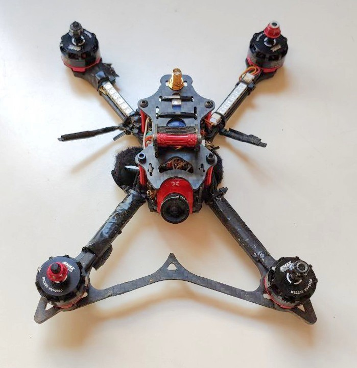
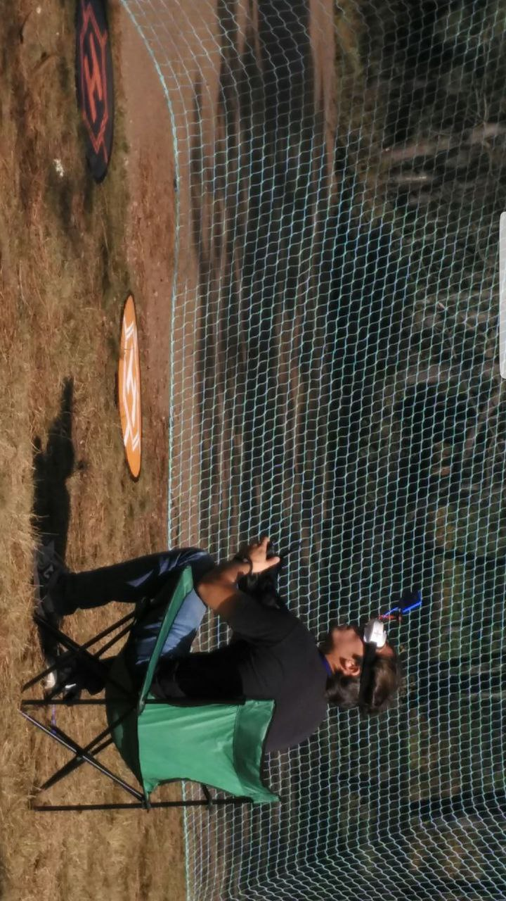

---

title: "A new member to the family: Racing Drone V2"
author: "Pablo Álvarez"
tags: [electronics, drones, fpv]
categories: electronics
image: /assets/img/posts/2017-08-08-Drones-2/3.jpg

---

After a couple of months flying the drone I built at the begining of this summer (check it! ENLACE), I reached the conclusion that, while this is not an expensive hobby, at the begining you may have to buy **a lot** of replacement parts for your drone (it is impossible to learn how to fly fpv without crashing).

Some time ago I found myself in a situation where I had almost enought replacement parts as for building a second drone, so I thought, *why not?*, and after reusing some of the parts I had repaired and buying some new ones, I ended up with a second revision of my original racing drone!

## Parts

This second version is made of the following parts:

- PDB: None (the 4 in 1 ESC already has one)
- ESC: Racerstar 4 in 1 35A
- FC: Matek F705
- Motors: Emax RS2205
- Props: 5'
- Camera: Foxeer Predator v3
- VTX: InmersionRC Tramp HV
- Frame: *Aliexpress*
- Receiver: Frsky R9 MX

I use the same transmitter as before: a Taranis X9D with a R9M module.

## Assembly and firmware setup

I will no cover step by step how to assembly all the parts, flash the corresponding firmware and configure the different options betaflight offers, since there are tons of information aroud the Internet, and I already wrote a summary of my personal experience in the last post.

This process is pretty much the same for all types of racing drones, independently on the parts you chose. The only big difference between this drone with the first revision is the attatchment of some RGB LEDs, in order to record some videos at night. If you are interested in adding LEDs to your drone, I suggest you following [this](https://oscarliang.com/setup-led-betaflight/) guide, which explains everything with lot of detail.

## Testing and first flights

This drone is capable of flying faster than the first revision, probably due to its better mottors and less weight. Moreover, the new frame with the LEDs give it quite a professional appearance, which looks great (specially at night).

## Conclusion

Thanks to the great compatibility between the differnt pieces of hardware and Betaflight's firmware, it is possible to make a good drone by mixing some pieces you have lying around with some new ones. 

This rev. 2 drone ended up being faster and lighter than the original one, so I will use it to train in circuits rather than practicing freestyle.

