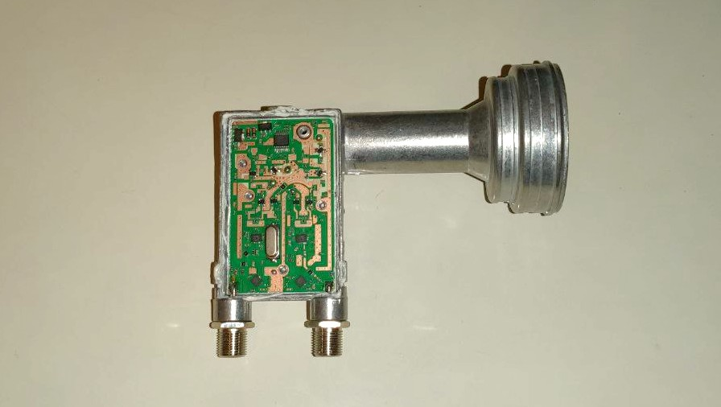
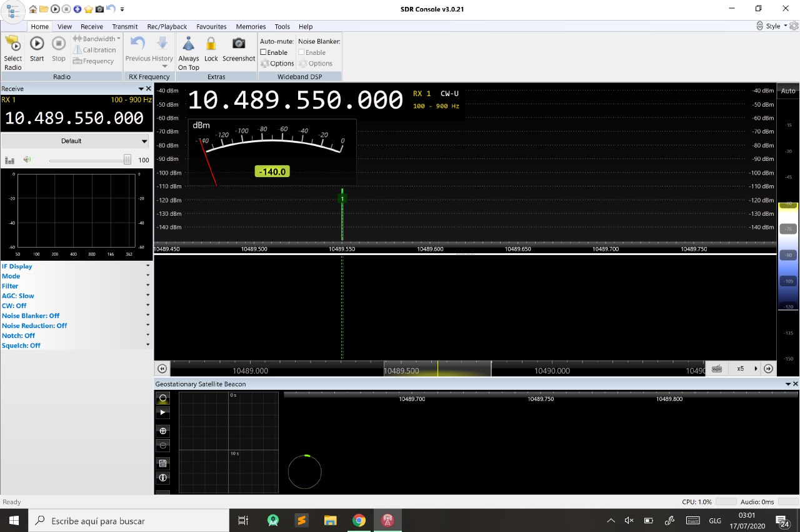
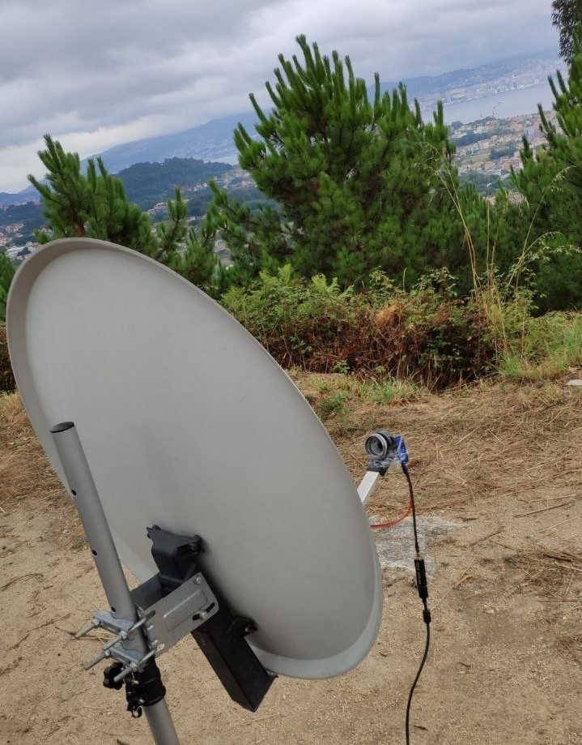
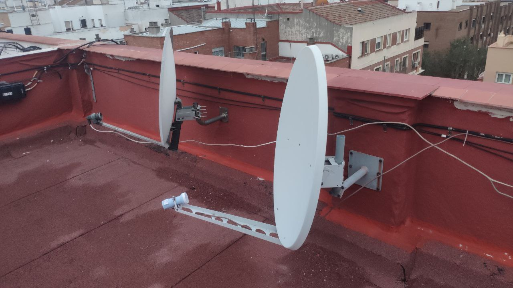
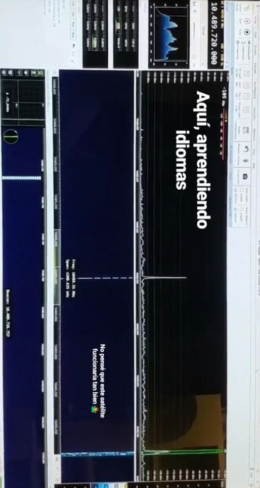

I am back to the University, so I will not have time for going outside and cath some LEO satellites anymore. Unfortunately, there is no easy alternative for receiving images from Earth in this situation, since it is not feasible receiving either LRIT or HRIT from a geostationary satellite in my QTH.

One weekend not so long time ago, I wen to a Ham radio convention called Iberradio. There, I attended some conferences about amateur radio satellites and how to opperate the. I decided then to try something new and focused on these new birds. One of them draw my attention over the rest: it is called Es-Hail 2, but is also known as QO-100. It is the only satellite in the GEO orbit with an amateur radio transponder, so I decided that trying to receive a satellite located more than 35.000Km away could be a cool challenge.

## Hardware:

In order to get a basic receivig station working, only the following material is needed:

  - **Parabolic reflector**: anything bigger than 60cm will do the job. Mine is 80cm.
  - **PLL based LNB**: I have both a SatSignal and an Octagon LNB. For more information about valid devices, check [this](https://www.amsat-ea.org/app/download/11639088/Estaci%C3%B3n+sat%C3%A9lite+QO-100+-+EA4BFK+IBERRADIO+2019.pdf) great presentation by EA4BFK.
  - **75Ohm coax cable**: the ammount you need to connect your antenna to the SDR.
  - **Impedance matching network** (Very optional): in critical cases, it can help reducing return loss between the 75Ohm coax and the 50Ohm SDR input.
  - **Bias tee**: to power the LNB with DC. I made my own with a PCB I did not use that was meant to be a filter, soldering a capacitor in series, an inductor in parallel and come decoupling capacitors.
  - **12/13V DC Power supply**: connected to the bias-T.
  - **SDR**: even the cheapest should do the job.

## Software

In reality, any SDR software could be used for demodulation purposes. However, the standard here is using SDRConsole. This is because, usually, you will experience some frequency drift due to the low precision of the crystal oscillator reference frequency inside the LNB, temperature changes, etc. Dependins on the seriousness of this drift, you may find yourself unable to understand converstions at SSB or use digital modes. SDRConsole software providesa frequency correction function: by locking to the satellite's BPSK beacon, it can change the frequency of the demodulator accordingly to equilibrate this drift.

Summarizing the whole process, after you install the program, the only thing you have to set up in order to have everything working is selecting your SDR, adding a downconverter with a LO frequency of 9,75GHz and click on the waterfall of the BPSK beacon inside the *Geostationary Satellite Beacon* plugin. 

For a detailed tutorial, you can check [this](https://www.f5uii.net/reception-satellite-qatar-oscar-100-phase-4a-eshail-2-sdr-console-sdr-radio-software/5/) website, hich has a pretty complete explaination.

## Results

Before setting everything up definitively in my rooftop, I decided to try it as a portable setup with my laptop and a tripod for the this

After I mounted everything and pointed the dish towards the satellite, I could clearly hear the Morse beacon and some other conversations in SSB!

I then decided to install it in my rooftop. Again, the project was succesful, since I could clearly hear any conversation on the satellyte from my bedroom.

I am currently looking foward buying a ham radio transceiver and building the transmitter part of the setup, but that won't be that easy!
