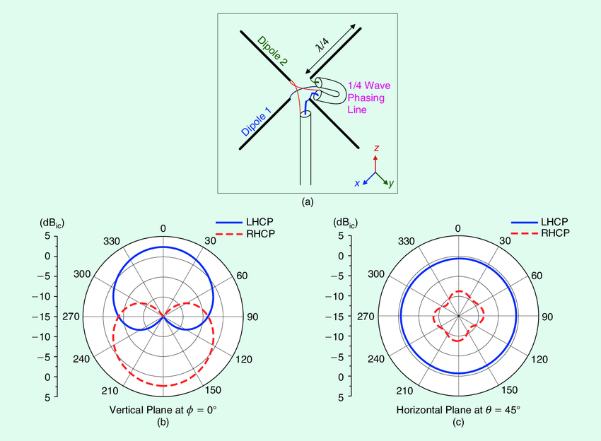
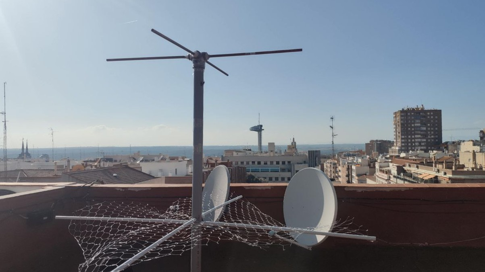
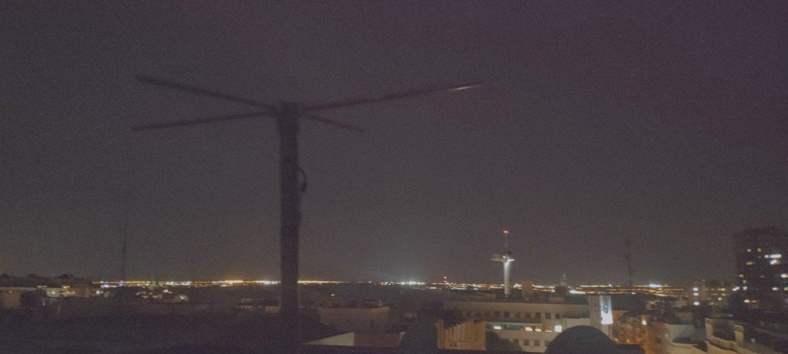
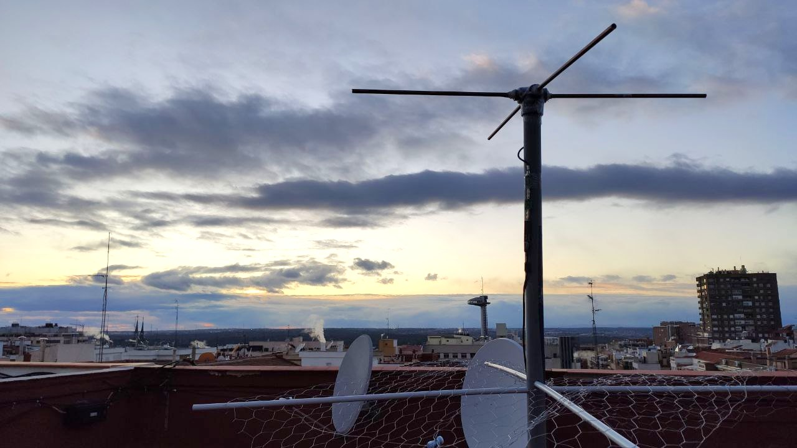
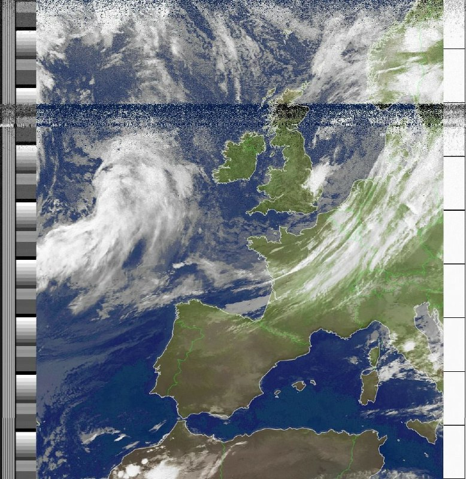
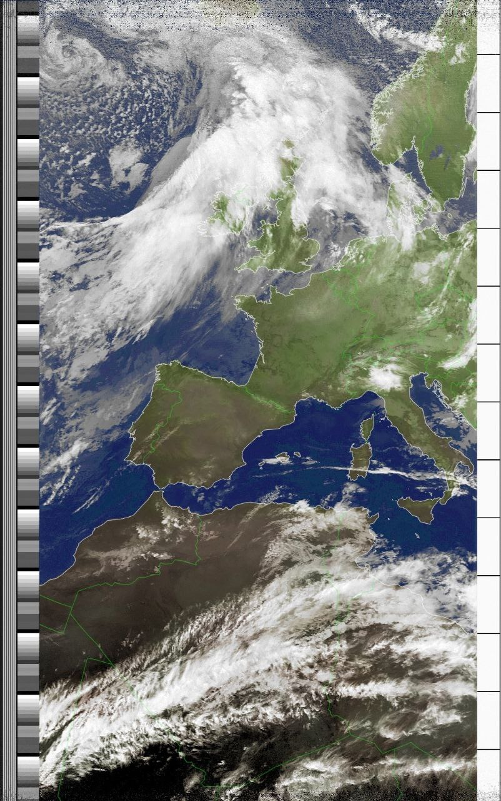
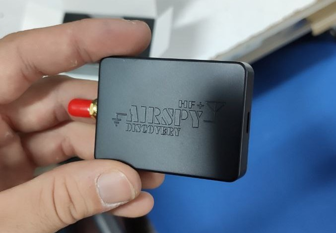

A lot of time has passed since my last NOAA reception. This is in part because the antenna I was using (a double cross antenna) is not in very good conditions; it has always been a little bit fragile due to its mechanical complexity (I do not have a 3D printed so I used glue and tape instead) and it has been getting damaged little by little every time I used it.

This weekend I wanted to resume my meteorological satellite activity, but I needed either to fix the antenna or to build a new one, so I took this as an oportunity to try a different type of antenna: the turnstile

## The turnstile antenna

A turnstile antenna is nothing but two perpendicular dipoles with a phase shift of 90º. It can be seen as the circular polarization variation of a single dipole, since that delay line introduces the necessary shift for getting the RHCP we want. 

These antennas usually come with a ground plane underneath. You can use either some kind of metal mesh (as I did)  or directly place two metal bars parallel to the dipoles like the reflector of a normal yagi. This produces a pretty interesting effect: 

Note that this antenna would provide RHCP for $\theta<90º$ and LHCP for $90º<\theta<180º$. Yet, circular polarization changes its sense of rotation when bouncing on a reflecting surface. In this way, adding a reflecton on the LHCP side not only changes the radiation pattern by increasing the directivity of the antenna on the upper plance, but only does so by maintaining the original RHCP we wanted.

Choosing the distance between the reflector and the dipoles can be a bit tricky. I personally used a $3/8\lambda$ distance, since it offers good coverage at low elevations (despite having less gain at $\theta = 0$).

(Image taken from [here](https://www.researchgate.net/profile/Son_Xuat_Ta/publication/282776048/figure/fig1/AS:614287487819806@1523468958852/A-turnstile-antenna-a-The-3-D-view-and-b-its-vertical-plane-pattern-c-and.png))

*Note:* some authors recommend using 75Ohm coax for the phasing line to get a better impedance match between the antenna and the 50Ohm coax.

## Building and tuning the antenna

I won't make a separate bill of materials since the only thins you need are a cople of copper tubes (for the active elements of the dipole), a metallic mesh, some PVC pipe to make the mast and RG-58 or better coax cable.

Provided that you have some measurement tools to measure SWR or S11 parameter of the antenna, I suggest you cutting the dipoles a bit longer than needed and trim off small pieces of copper untill finding a good resonance at 137-138MHz. 

In my case, I decided to go for a portable setup, so the mesh (I bought the one that here is used for building chicken fences) and the dipoles are both independent from the PVC mast. In this way, I can carry them in my car withou problems. 

You can see the QO-100 stationat the back, about which I wrote my last post.

## Results

Here are some pictures of my final setup:

And these are some of the images I was able to capture:

*Note:* I also upgraded my SDR! Now, I am using an Airspy HF+ Discovery. It gives much better result than my last generic SDR. Highly recommended!

