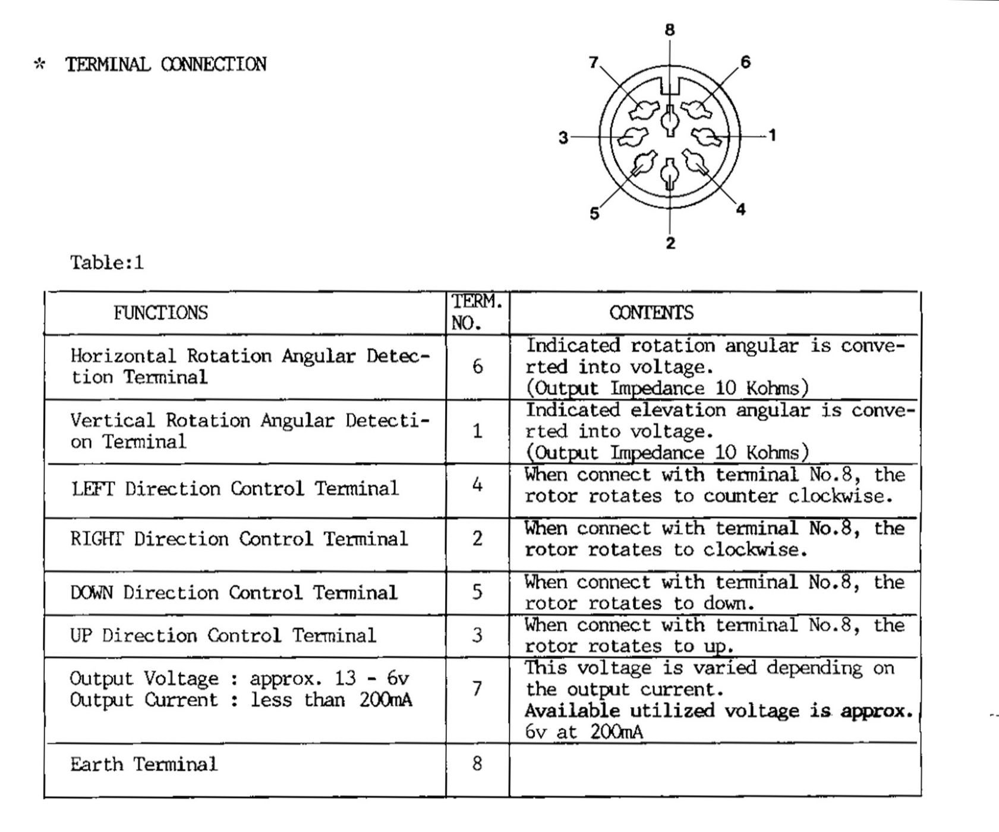
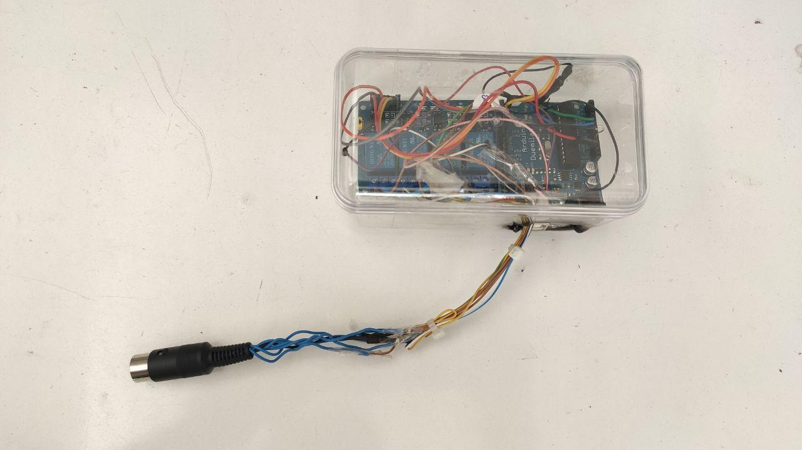
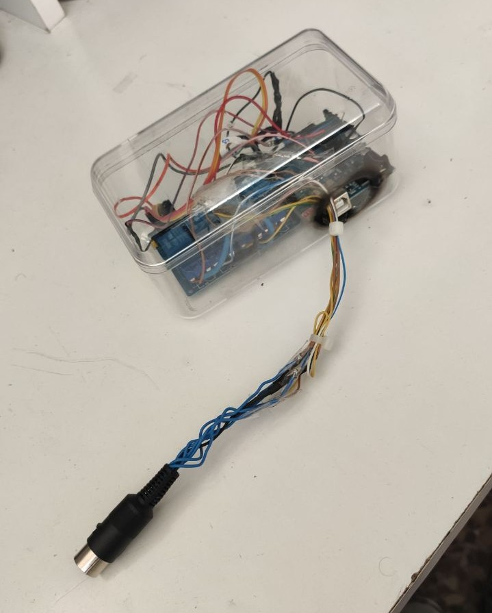

At the begining of September, I joined the Radioclub E.I.T. (EA4RCT). Since then, we have made some projects together, such as trying to "upgrade" some of the old-fashined analog equipment we have. As a part of this, we managed to connect our antenna rotator to the internet for being able to operate it remotely and, in a future, leave an SDR server conected to these antennas for live working satellites online. 

The main objective here was then being able to create some sort of PC-Rotor interface for our Yaesu G-5500 to point in a specific direction depending on the command it received. Moreover, it would be cool to have it connected to a tracking program such as GPedict or Orbitron, making up this an automated tracking system.

You can find another post about this project in the [EA4RCT website](

## Hardware
The necessary hardware for this project will be:

+ Arduino UNO R3
+ Relay module, with a minimum of 4 relays
+ 8 pin DIN connector

Our rotator controllers, as it happened with the majority of controlers 15 years ago, have on their back a female 8-pin DIN connector. This connector acts both as an input (sorting some pins to ground can trigger the rotor) and as an output interface (two analog outputs send information about both the elevation and azimut at that moment):



Using an Arduino, we will read the analog values of pins 1 and 6 (azimut and elevation of the antenna), and, by activating some of the relays on the external board, we will control the movement of the rotor. This can easily be programmed by using the analogRead() and digitalWrite() functions.

## Software

The true complexity of this project relies on the communication between the satellite tracking software (we will use GPredict for our testing purposes) and the Arduino per-se.

In order to facilitate the communication between both, we will implement an existing protocol. For that, we will use a library called [Hamlib](https://hamlib.github.io/), which allows us to send GPredict live data about the relative position of a satellite throught a serial port by using an specific protocol. Our Arduino program must be able to process that data and calculate how much should the antenna rotate in order to point to the desired spot. As GPredict includes native support for that library throught a TCP port, we can leab Hamlib running in our server PC and send the desired data to it throught the internet from our GPredict client. 

Hamlib is compatible with a large variety of protocols used by many modern models of rotors:

```
Rig #  Mfg                    Model                   Version         Status
     1  Hamlib                 Dummy                   0.2             Beta
     2  Hamlib                 NET rotctl              0.3             Beta
   201  Hamlib                 EasycommI               0.4             Beta
   202  Hamlib                 EasycommII              0.4             Beta
   204  Hamlib                 EasycommIII             0.4             Alpha
   301  XQ2FOD                 Fodtrack                0.2             Stable
   401  Idiom Press            Rotor-EZ                2010-02-14      Beta
   402  Idiom Press            RotorCard               2010-02-14      Untested
   403  Hy-Gain                DCU-1/DCU-1X            2010-08-23      Untested
   404  DF9GR                  ERC                     2010-08-23b     Alpha
   405  Green Heron            RT-21                   2014-09-14      Alpha
   501  SARtek                 SARtek-1                0.2             Untested
   601  Yaesu                  GS-232A                 0.3             Beta
   602  Yaesu/Kenpro           GS-232                  0.1             Beta
   603  Yaesu                  GS-232B                 0.2             Beta
   604  F1TE                   GS232/F1TE Tracker      0.1             Beta
   701  WA6UFQ                 PcRotor                 0.1             Untested
   801  Heathkit               HD 1780 Intellirotor    0.1             Beta
   901  SPID                   Rot2Prog                1.0             Stable
   902  SPID                   Rot1Prog                1.0             Stable
  1001  M2                     RC2800                  0.1.1           Beta
  1101  EA4TX                  ARS RCI AZ&EL           0.1             Beta
  1102  EA4TX                  ARS RCI AZ              0.1             Beta
  1201  AMSAT                  IF-100                  0.1             Untested
  1301  LA7LKA                 ts7400                  0.1             Beta
  1401  Celestron              NexStar                 0.1             Untested
  1501  DG9OAA                 Ether6 (via ethernet)   0.1             Beta
  1601  CNCTRK                 CNCTRK                  0.1             Untested
```

In my case, I decided to go for a protocol called Easycomm II. Its full list of commands is avaliable [here:](https://github.com/Hamlib/Hamlib/blob/master/easycomm/easycomm.txt)

```

Command		Meaning			Perameters
-------		-------			----------

AZ		Azimuth             number - 1 decimal place [deg]
EL		Elevation           number - 1 decimal place [deg]
UP		Uplink freq         in Hertz
DN		Downlink freq		in Hertz
DM		Downlink Mode       ascii, eg SSB, FM
UM		Uplink Mode         ascii, eg SSB, FM
DR		Downlink Radio      number
UR		Uplink Radio        number
ML		Move Left
MR		Move Right
MU		Move Up
MD		Move Down
SA		Stop azimuth moving
SE		Stop elevation moving
AO		AOS
LO		LOS
OP		Set output          number
IP		Read an input       number
AN		Read analogue input number
ST		Set time            YY:MM:DD:HH:MM:SS
VE		Request Version
```

As we only want to control a rotor and not a radio transceiver, the only command to be implemented will be AZ and EL. For that, our program will be based on a serial buffer where it will store the last characters received throught the serial port, and try to identify whether any of these strings match "*AZ*" or "*EL*". If so, it will save the number that follows the command. 

Once this value has been received and is stored in a variable, the program reads the corresponding analog port in order to get information about where the antenna is pointing at that moment. Lastly, this value is compared with the one received by serial port and, if they are sufficiently different (as we are working with analog values we expect some small error range), one of the digital outputs is activated to move the rotor.

## Results

If you are interested in building yours, you can find the source code both in my [Github](https://github.com/pepassaco/AutomatedRotorTracker) and in [EA4RCT's GiTea](https://git.radio.clubs.etsit.upm.es/Pablo/AutomatedRotorTacker).

Here are some photos of the finished build:




