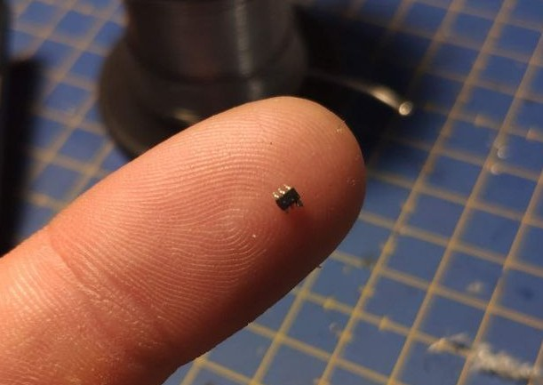
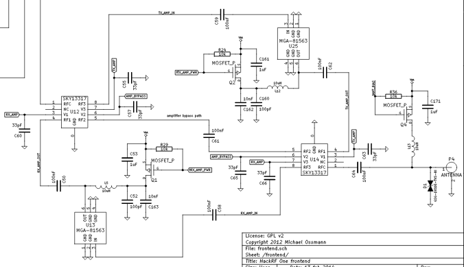
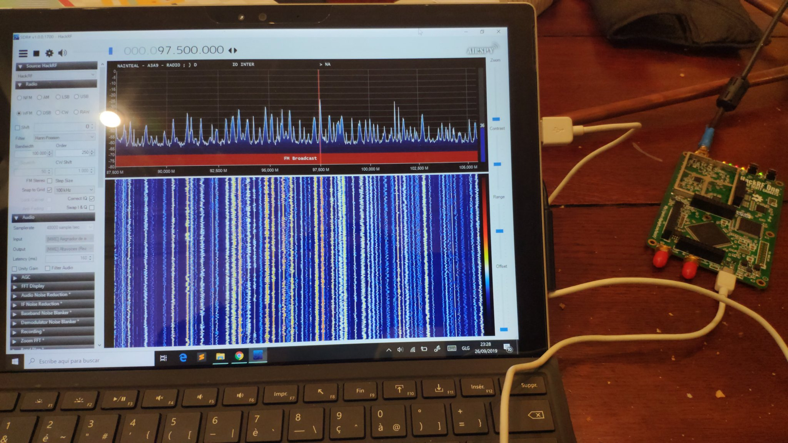

This will be a pretty short post I would like to share in case someone finds it useful. Basically, I was giving a defective/broken HackRF and was asked whether I was able to repaire it. I took that both as a personal challenge and as an oportunity to learn a bit more abour RF circuitry and electronics, so I accepted.

## Diagnosing the device

The first step to take before trying to repair anything is identifying the problem and, if possible, locating the origin of the flaw. For this purpose, I connected the HackRF to the PC and opened SDRSharp. It recognised the device well and ploted both the FFT and the waterfall. This was a good indicator that both the power circuitry and the USB interface were working seamlessly.

The next logical step was connecting an antenna to it. I connected a dipole I had laying around and tried to tune the SDR to an FM radio channel frequency. Surprisingly, there was no signal: the waterfall remained the same with and without antenna. Since FM broadcast is transmitted with a **lot** of power, this could mean that there was a problem in the RF section of the board.

After trying some different options in SDR Sharp without any success, I ended up opening the HackRF.

After a first quicksight, I did not notice anything special (or at least nothing drew my attention). I saw a middle piece of metal at the bottom left of the board that I supposed was covering the RF circuitry to protect it from interferences. After cleaning a bit the whole board with some isopropyl alcohol, I decided to remove this metal plate. I was pretty surprised that inside that metal box there was what seemed to be a desoldered component!

## Repair

Without knowing anything about the PCB itself, it was completely impossible to try to repair it. Fortunately, the HackRF is an open source device, which means that all of its [schematics](https://github.com/mossmann/hackrf/blob/master/doc/hardware/hackrf-one-schematic.pdf) are freely available on the internet.

After some time looking at the schematics, the PCB and the datasheet of the desoldered component, I ended up and knowing what was going on: the component itself was a FET transistor that acted as an LNA. Therefore, the absence of this transistor in the schematic was creating an open circuit between the input and the ADC.

The solution was in fact pretty simple: with the pinout of the transistor and the schematic, I just soldered the missing component on its corresponding place, and prayed for that to be the only problem on the board

## Results

After cleaning everything up, I pglugged the HackRF to my PC, opened SDR#, and it was working fine!

