Since I joined the Radiocliub EA4RCT, I discovered a new wolrd I did not have access to before: the HF bands. Due to the size of the necessary antennae and price of decent transceivers, I was not able to experiment at these frequencies untill now. 

Here I present you one of my first and most sucesful projects on HF: automating the reception of Weather FAX.

## WeFAX

WeatherFAX or WeFAX consists on a weather report sent through a fax signal. Its main addressees are all type of watercraft that work offshore, in the middle of the ocean. As the achiveable range of this signal must be extremely large (almost global), WeFAX are transmitted in HF (usually in the 20m and 40m bands), and uses ground wave propagation. 

In Europe, the two main transmitting stations are the one from Hamburgo (Denmark) and the one from Northwood (England). In our case, we will be focusing on receiving those fax sent by the english station, since it is closer to us. For that purpose, we will use a 3 element HF yagi.

## Software

For our testing purpose, we will use a Windows 10 computer with the following software:

+ **SDRsharp**: or controling the Airspy SDR

+ **VCable**: audio pipe

+ **FLdigi**: WeFAX decoder

## Setup

Thanks to the automation options FLDigi already includes, it will not be difficult to set up an automated station for recording the received faxes and saving the output to a .png format image

The first step is setting up the SDR. For that, just open SDR#, select the desired frequency and choose USB as the modulation type. Note that the bandwidth of the signal is around 1,9KHz, so we really want to tune 
1,9KHz lower than the frequency provided by the coastal station. Besides, WeatherFAX are not emitted in a consitinuous way: they follow an specific schedule. You can check both the transmitting frequency and the schedule in the [following document](https://www.google.com/url?sa=t&source=web&rct=j&url=https://www.nws.noaa.gov/os/marine/rfax.pdf&ved=2ahUKEwiR9Oahv6jmAhWP2BQKHZg-ByUQFjAAegQIARAC&usg=AOvVaw3fdJ9rrQb4-ctYOJyKXv5C). Lastly, you must choose VBCable as the audio output of SDR#. Turn the volume to it maximum to avoid future problems.

Once we have SDR# ready, it is time to set up FlDigi. In the _Op Mode_ tab, coose _WEFAX-IOC576_. Uncheck the option called AFCC and wait until you receive a Wefax in order to calibrate the decoder. Once the wefax signal is shown on the screen, you will notice two yellow or ored lines in the waterfall. Move the three vertical red lines so that the line on the right matches the center of the right yellow strip. This will indicate FlDigi where the USB modulated signal is located in the audio spectrum, so that it can demodulate it and decode it. After all this, you should start seeing the desired image on the screen.

In case you find your image a bit missaligned or curved, you can try to correct it by using the _align_ and _slant_ buttons.

Here you can see a screenshot with my personal settings:

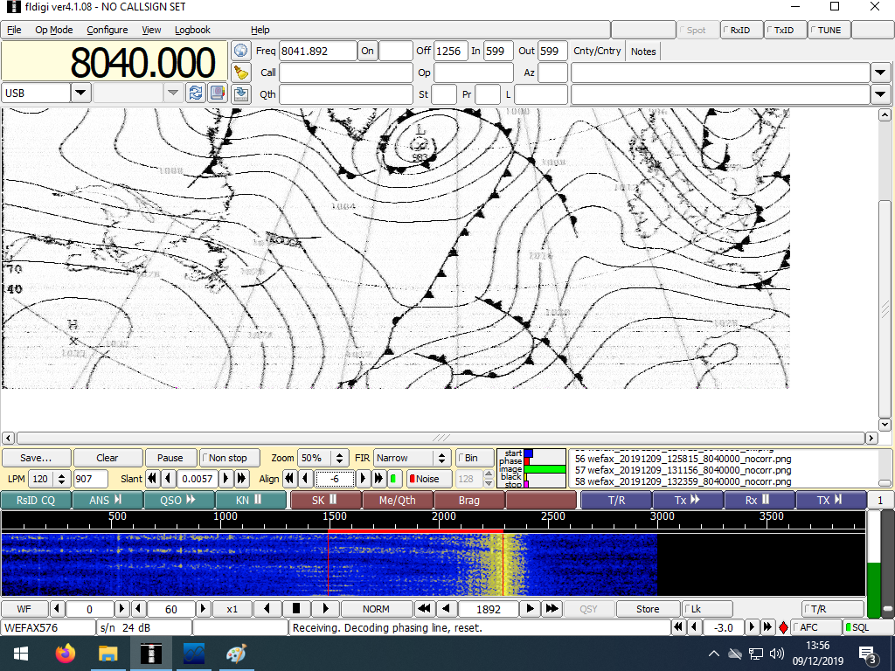

## First Results

The following images were sent during the days 7, 8 and 9 of December by the Northwood station:

 **Ice level** | **Wind map**
:-------------------------:|:-------------------------:
  | 
:-------------------------:|:-------------------------:
 **Wind map** | **Wind map**
 :-------------------------:|:-------------------------:
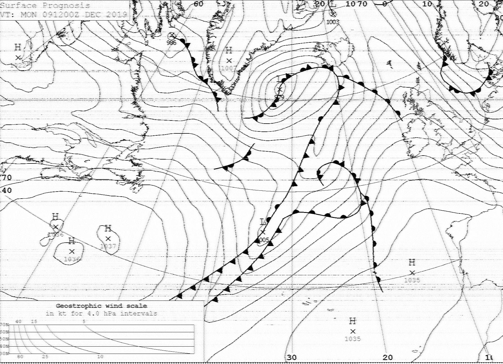  | 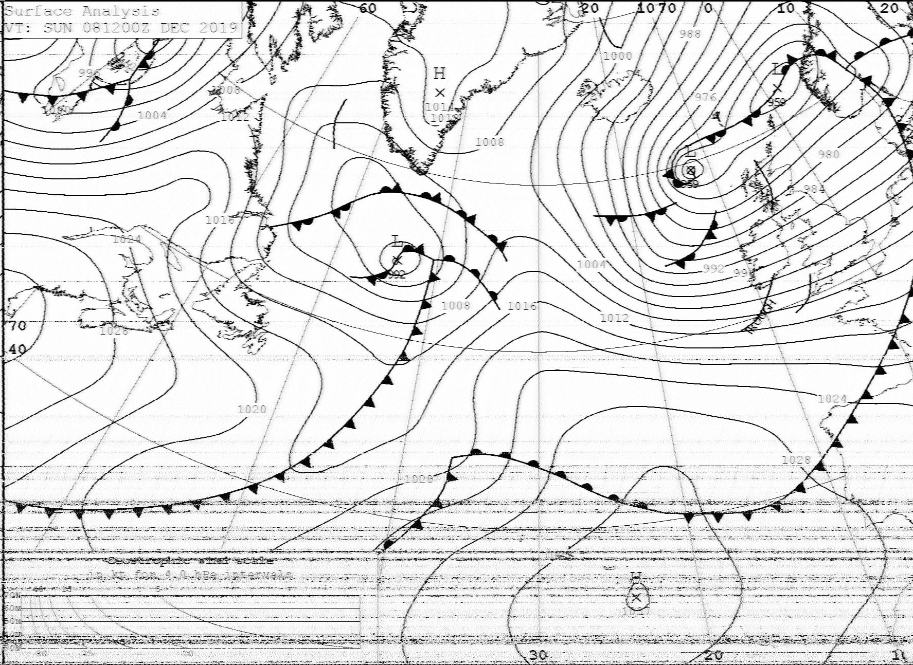

## Improvements

After these first tests, some changes were made in order to improve the reception. Some of them were:

#### Change of the coastal station target

I decided to try to receive faxes from Pinneberg (close to Hamburgo, Alemania). Whereas Nortwood was closer to my QTH (1800Km vs 1300Km), the station in Pinneberg transmit with more power (20kW frente a 10kW), which resulted in a huge inprovement on the power of the received signal.

Both transmit at very similar frequencies (7880KHz Pinneberg and 8040KHz Northwood). The only changes needed were pointing the antenna towards Germany, changing the tuning frequency and getting used to the new schedule.

#### Low-Noise mode

FlDigi includes a Low-Noise feature. Activating this option resulted in a little loss on the image quality, but helped in some situations such as signal fading or interferences.

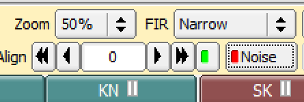

#### Substitution of the SDR by an analog transceiver

While the SDR offered a great performance, it cannot rest receiving WeFAX for the rest of its life. 

The solution was connecting an old Kenwood HF transceiver we had in the Radioclub to the PC throught an audio cable (audio output on the rig to line input on the PC). Remember to change the _source_ option in FlDigi accordingly.

## Final Results

After these improvements, we got some high quality images, such as the ones shown hereunder:

### Pressure and wind

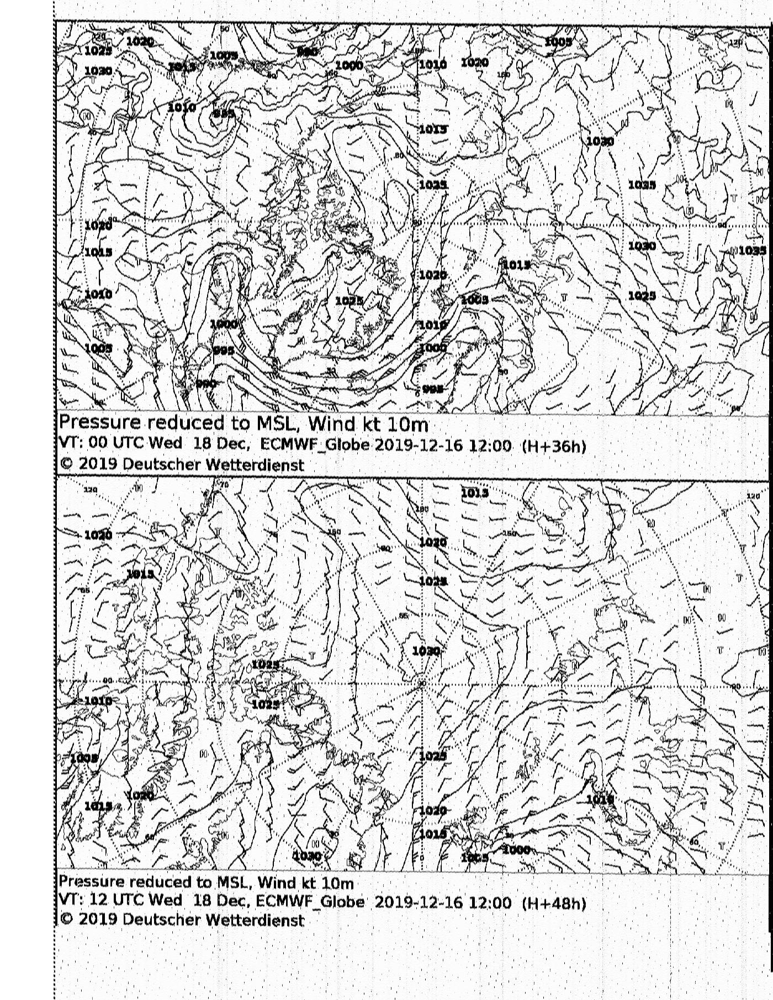

### North Pole

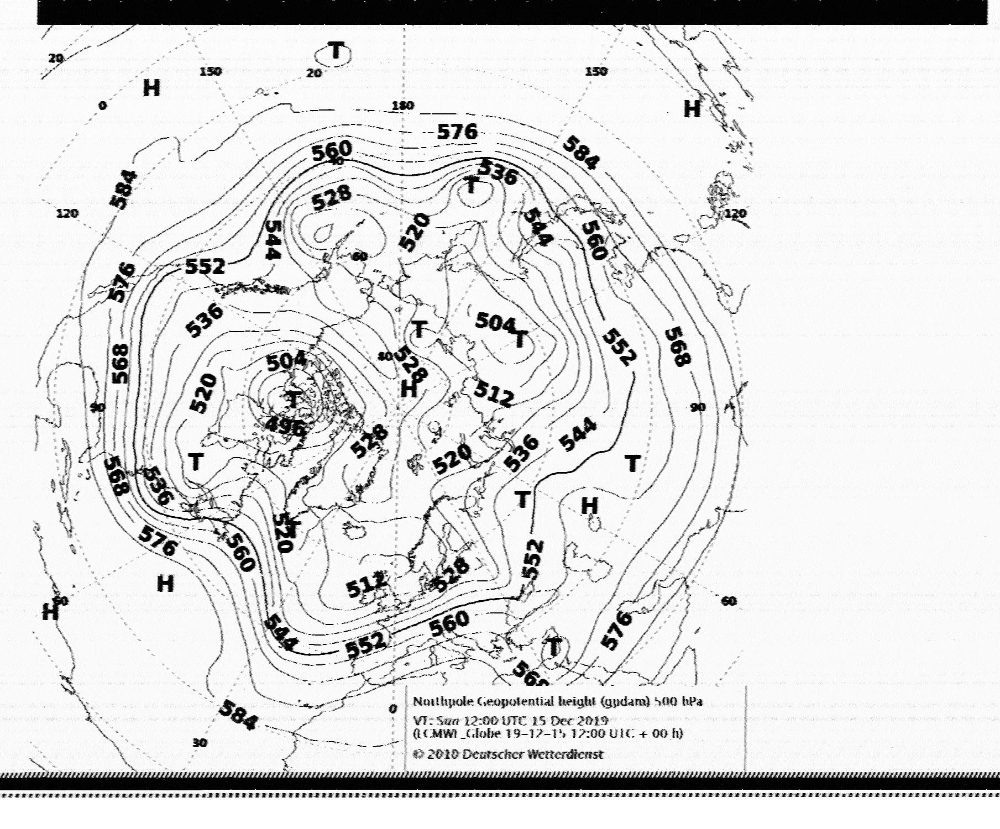

### Humidity at the North Pole

### Pressure map of Europe

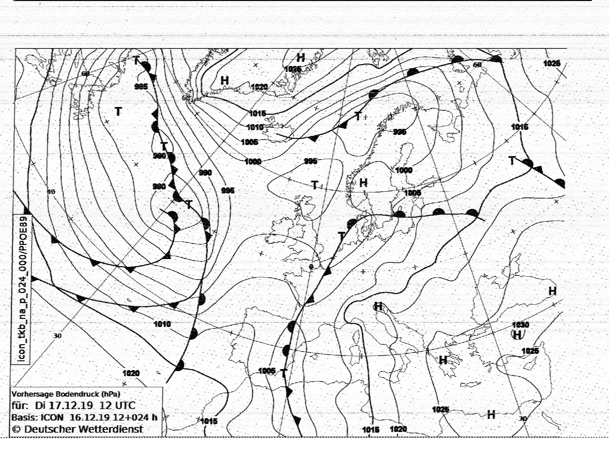

### Storms

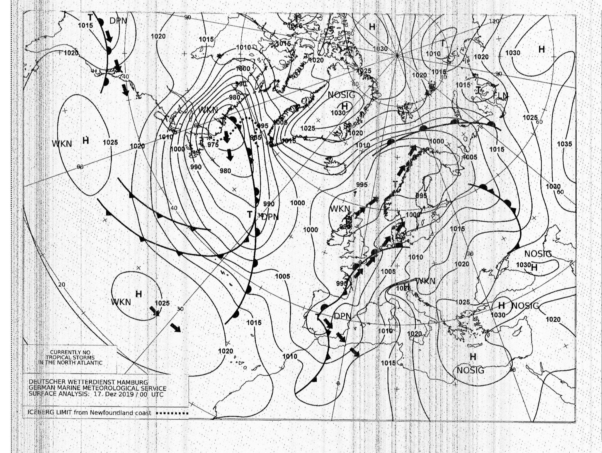

### Wind in the North Atlantic

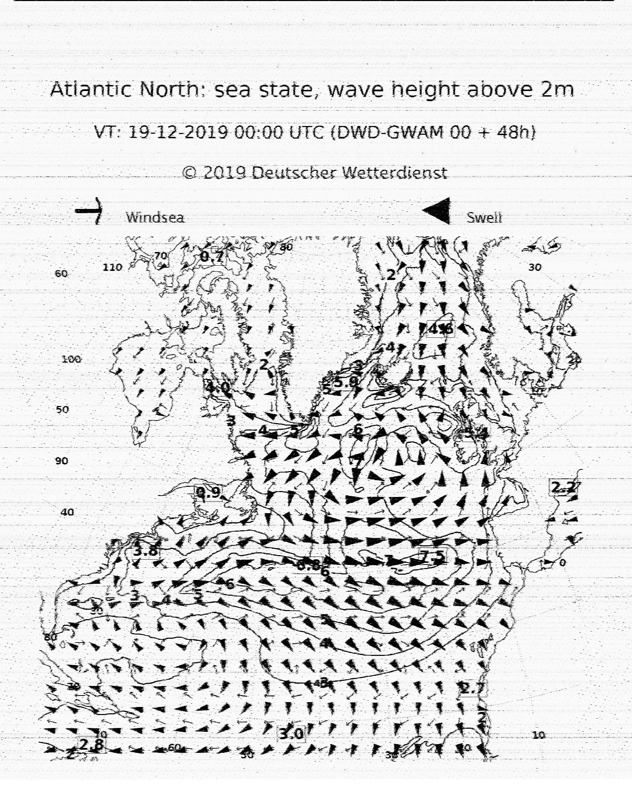

### Sea temperature in the North Sea

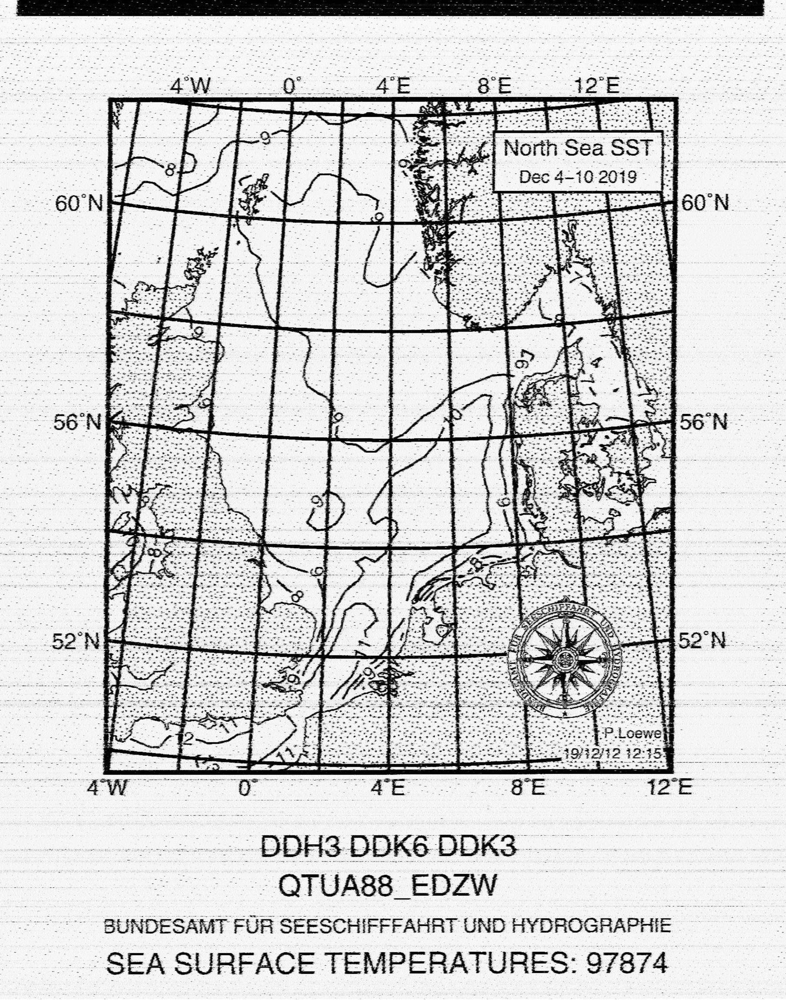

### TTemperature in the Ocean

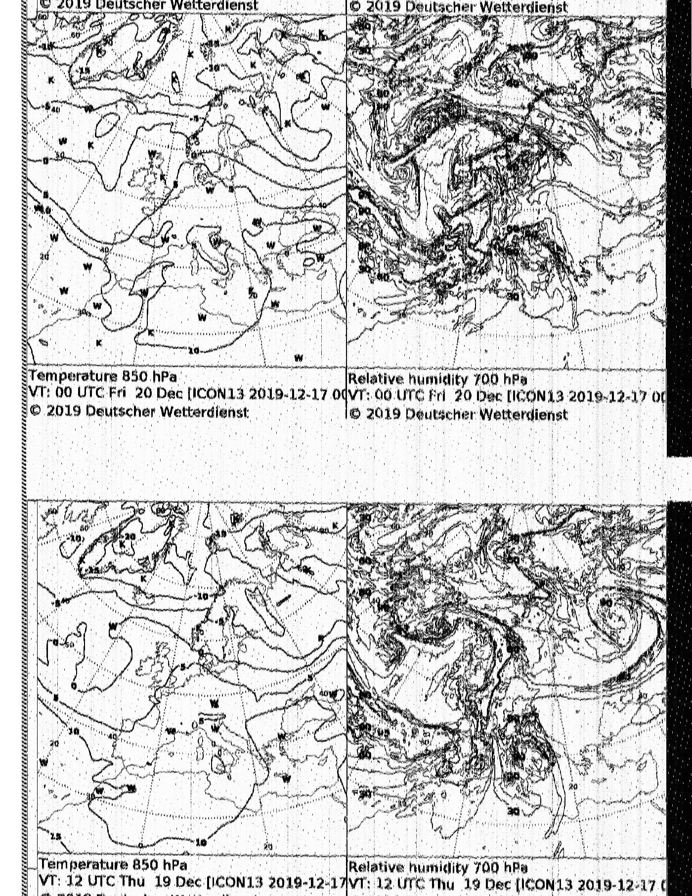

### Ice chart

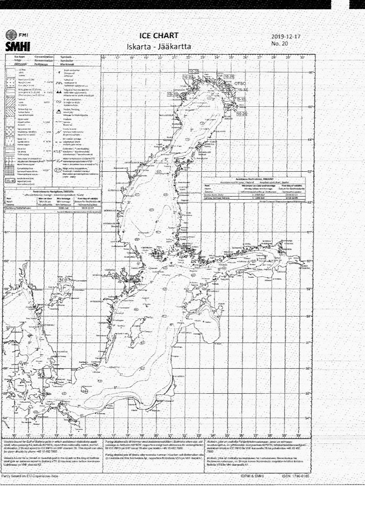

### Ice and Icebergs (Greenland)

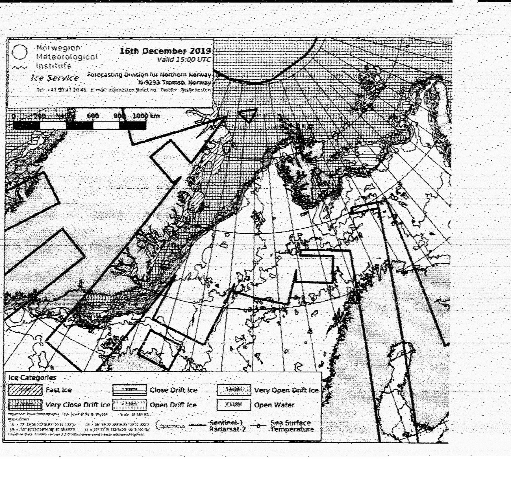

### FAX Schedule

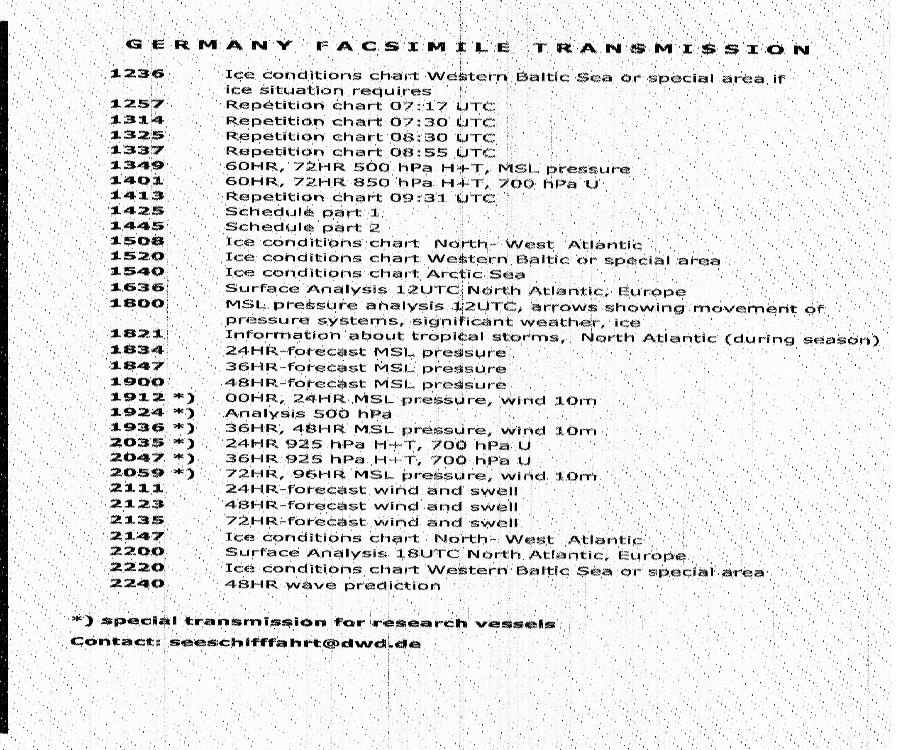

_mamado@EA4HFV_

