The international space station carries with it some amateur radio payloads. One of these instruments implements an SSTV transmitter, which is maintained mainly by the Russian team of the crew. While this transmitter is not always on and rarely sends information to Earth, in some special occasions, it's activated for ham radio operators to catch some commemorative images.

This is, in fact, what happened during the last week of December. I visited the web page of ARISS (Amateur Radio of the ISS) and saw that this transponder was going to be turned for some days. However, I was not in my usual QTH, so I didn't have any VHF antenna to get those images. I was forced then to improvise something.

In this post I will cover the build of a 3 element VHF yagi antenna. It ia made out of cheap materials, such as tape measure, a broomstick and packing tape.

## Hardware

The necessary materials to receive these images are:

 - **SDR**: I will be using my Airspy HF+ Discovery, but anyone will get the job done.
 - **Coax cable**: 50 ohm, I used some rg-58.
 - **A boom-stick**: preferably plastic or wood. I used a broomstick.
 - **Tape measure**: around 3m.
 - **Laptop**

The total cost of this project is under 30€.

## Building the antenna

Our antenna will be a linearly polarised three element yagi-uda, based on [this](http://theleggios.net/wb2hol/projects/rdf/tape_bm.htm) design by WB2HOL. Antennas of this type are not very directive: they can provide around 100° of beamwidth in the E-plane and around 65° in the H-plane. This means that, when trying to receive the corresponding SSTV signal, we will have to point to the ISS with the antena manually. Moreover, we will have to take into account an effect called Faraday Rotation. This is a strange phenomenon in our atmosphere that changes the polarization of the received signal when it crosses the ionosphere. Then, we will not only have to track the ISS itself but also rotate our receiving antenna depending on the polarizacion we are receiving.

In the following table you can see the measures of each of the elements in the antenna:

| Measure    | mm|
| --------- | :-----------: |
| Reflector length   | 1051 |
| Dipole length (each leg) | 490 |
| Director length   | 892 |
| Reflector-Dipole distance | 203 |
| Dipole-Director distance | 318 |

Plans of the antenna in inches:

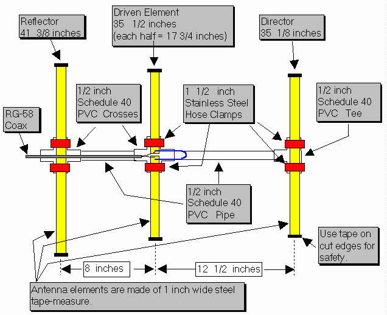

For the boom, we will can use any stick we have laying around (a broomstick in my case). Note that it must be made of a non-conductive material. If you want to use a conductive material such as copper or steel, you will have to recalculate each of the measures from above.

Lastly, with respect to the construction of the antenna itself, we must take into account that the active element of it is just a half-wavelength dipole. This means that, at its feet point, we won't have the exact 50 ohms that we need for the coax line, so we will have to build an impedance transformer. For solving this issue, I decided to try a hairpin transformer, since it is one of the easiest way to get the 50 Ohms we are looking for. Simply solder 12cm of a thin wire between the two elements of the dipole in an inverted U shape (this will create a shot circuit between boths ends of the coax, so remember to turn off your bias tee if you have any). That's it!

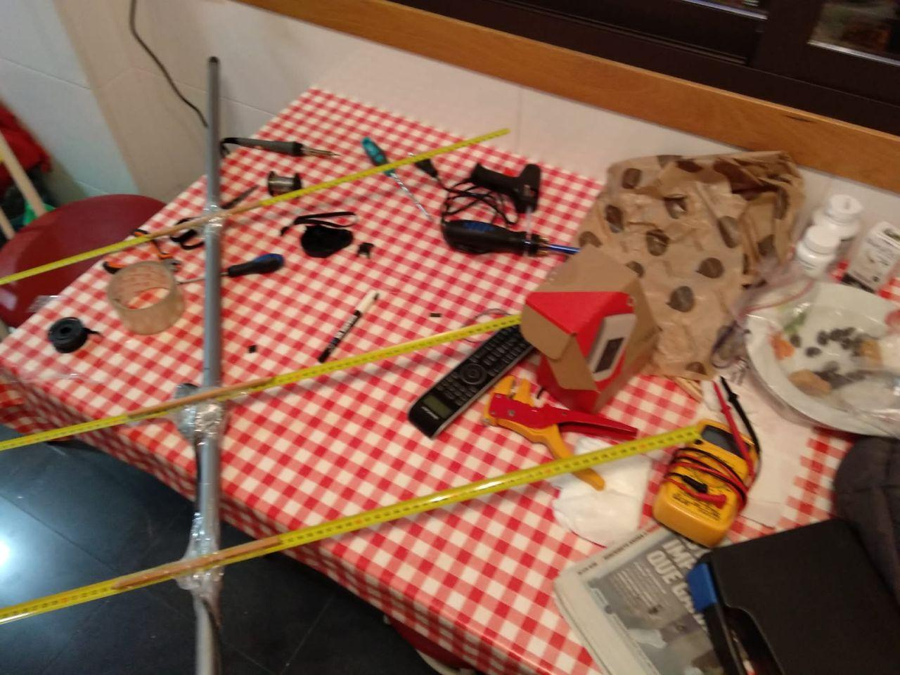

## Software

The necessary programs for this project are:

 - **SDR#**: As usual, for demodulating the signal.
 - **[RX-SSTV](http://rxsstv.cqsstv.com/)**: for decoding the image from the demodulated audio.

SSTV images are sent in narrow FM mode. This means that with any SDR program such SDRSharp will we be able to demodulate the received signal. Once we have the original audio, we must pipe it to another program in order to decode the image. In the case of the ISS, it uses a protocol called PD120. Select this option in RX-SSTV and, the input method, choose the audio pipe.

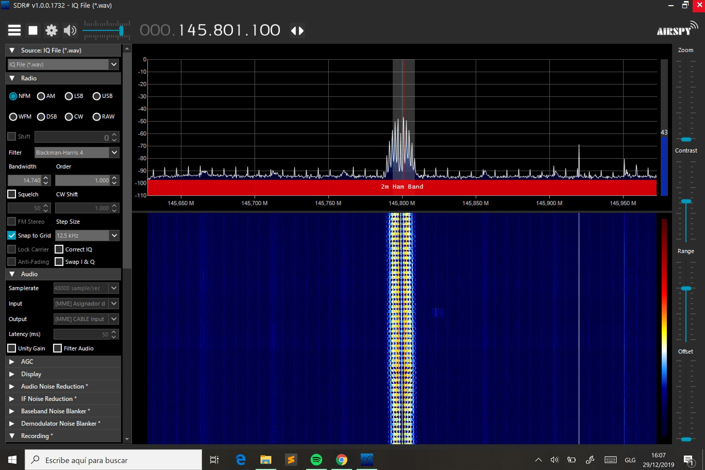

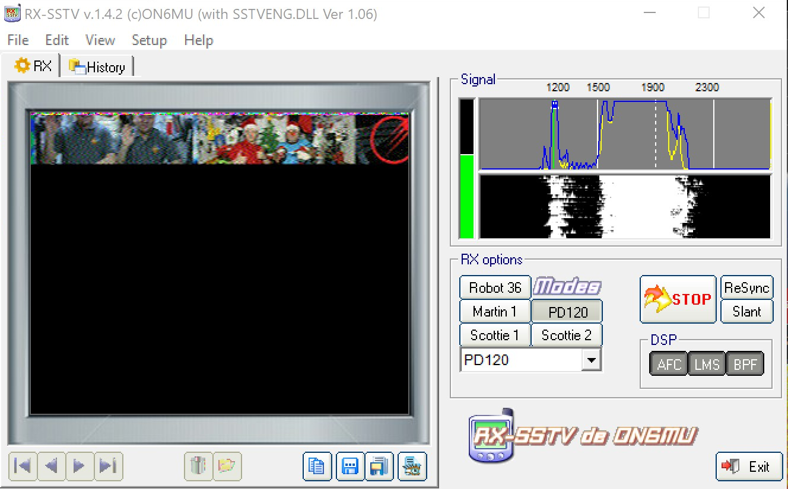

This process is pretty similar to the one already cover for receiving NOAA images and WeatherFAX.

Opcionally, but with the aim of improving the quality of the receved images, it is highly recommended using a satellite tracking program such as Orbitron in order to correct Doppler shift.

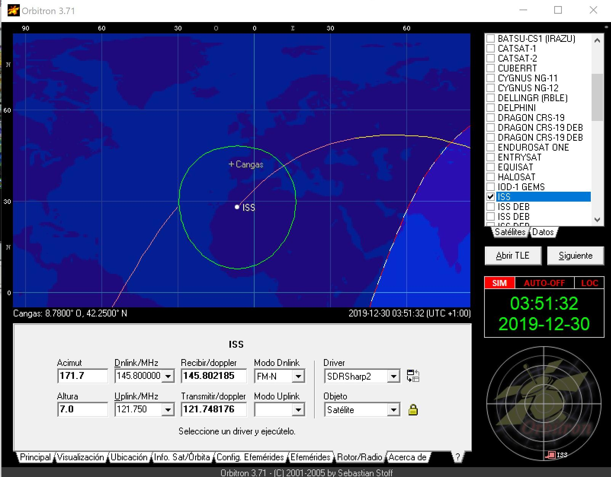

## Results:

Here you can see the complete setup I used in this project:

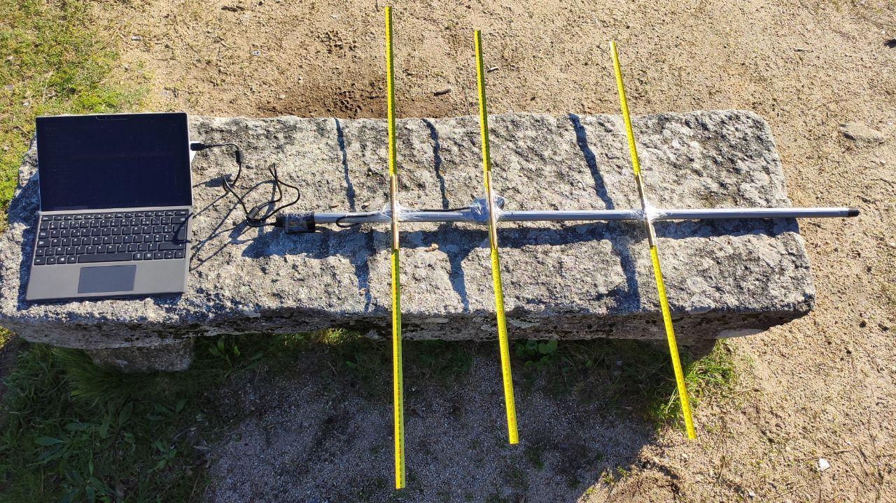

And these are the images I was able to receive:

**Complete images:**

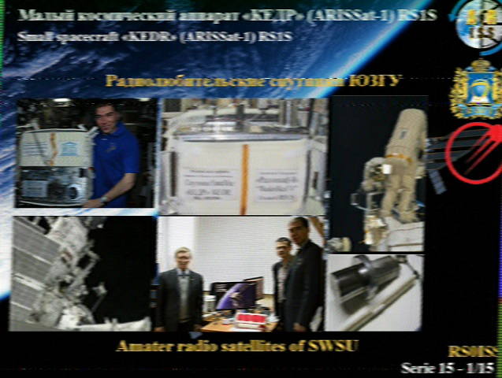

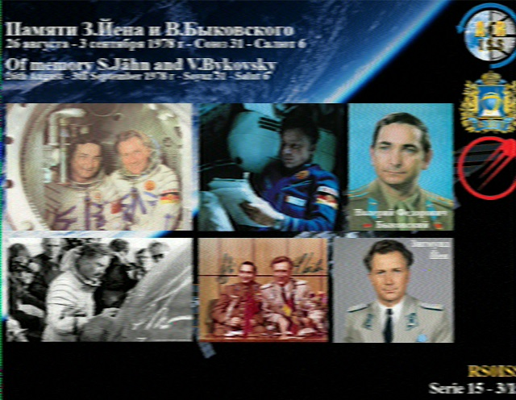

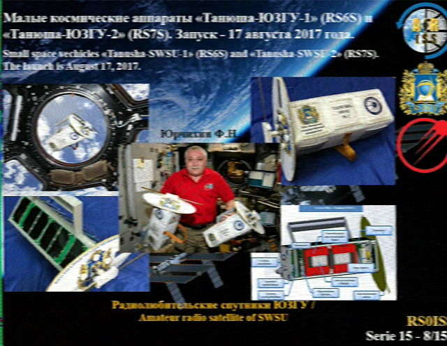

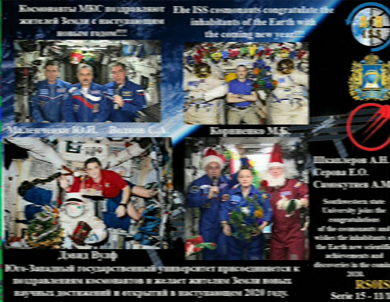

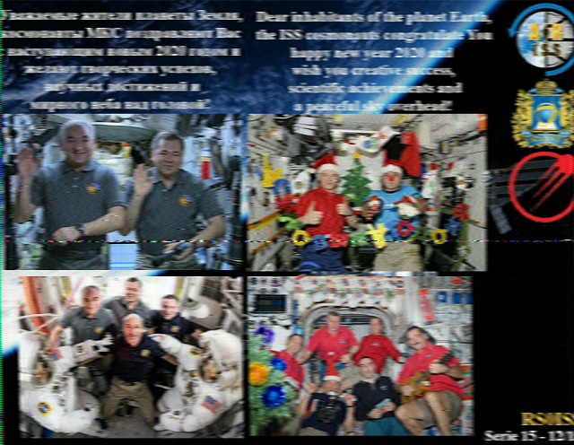

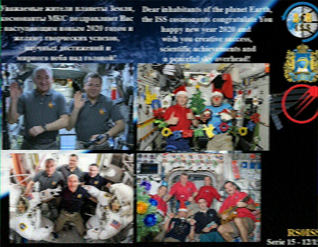

**Incomplete images (AOS or LOS during transmision):**

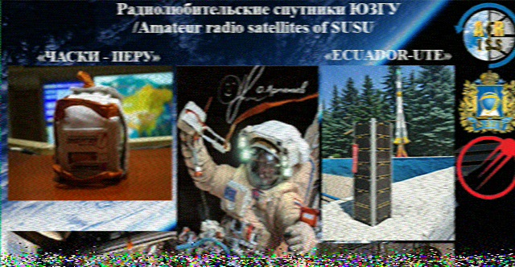

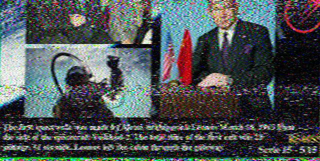

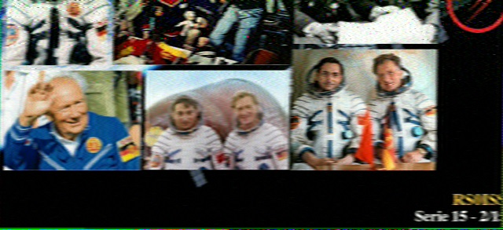

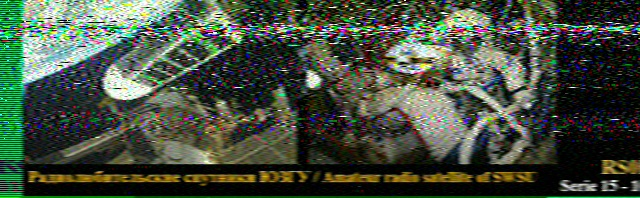

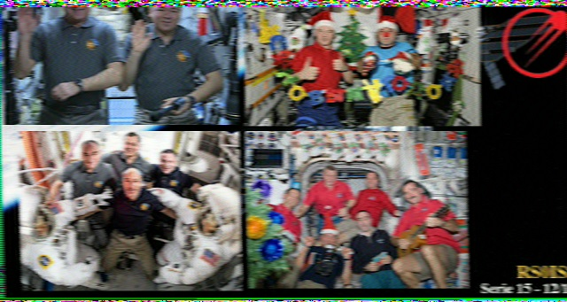

