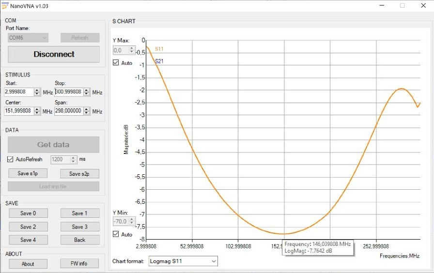
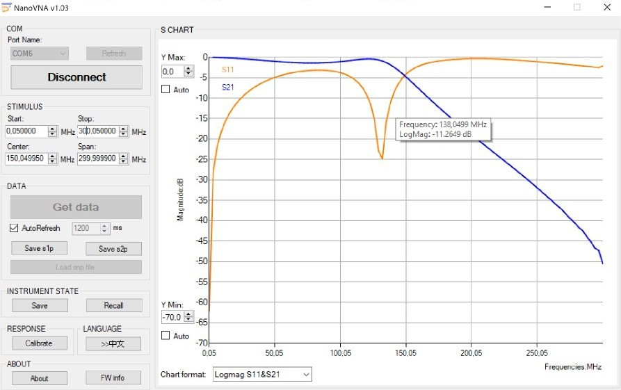
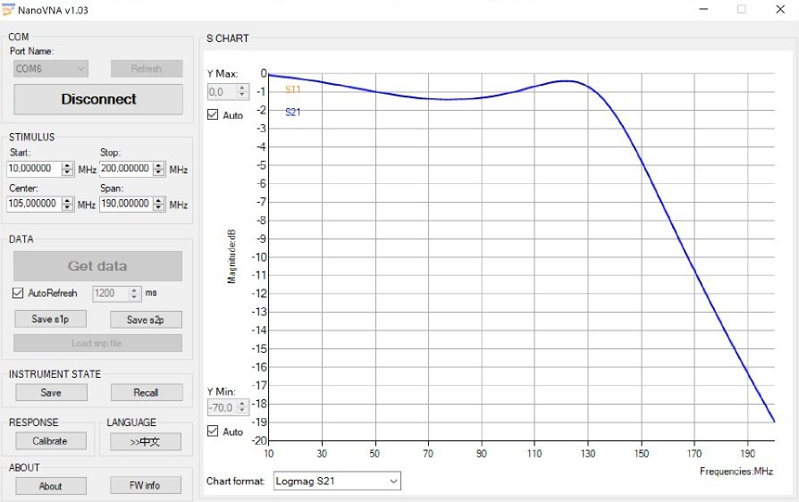
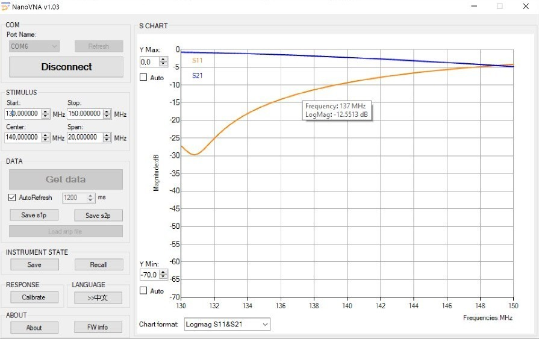
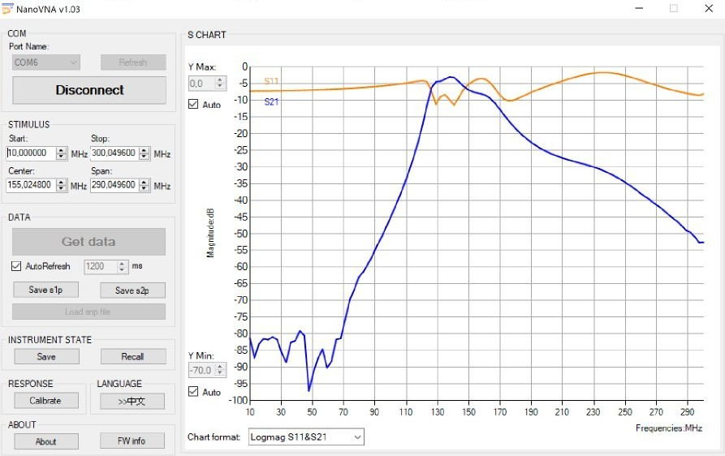

Today I will cover one of the new incorporations to my cheap-homemade lab: a NanoVNA!

## What is a VNA?

A Vector Network Analyser (VNA) is a measuring tool used to characterisd any piece of RF equipment in terms of what is called *S parameters*. The most important S-parameters in a four-port network are:

- **S11**: It measures the reflected power in a port, that is, the power that, once it reaches the next RF stage, returns to its current stage.
- **S12**: It measures the transmitted power between two devices, that is, the power that is transfered from one RF stage to the next one.

These parameters, which are given in decibels (dB), are pretty useful for charactersising antennas, filters, diplexers, connectors, etc. at high frequencies.

In the case of the NanoVNA, it is a extremely cheap analyser capable of measuring frequency responses from 50 KHz to 300 MHz. It may not seem to much, but, for its price, being able to measure any HF and VHF antenna is simply incredible. Note that being able to measure an antenna algo provides us the capability of **tuning** it, achieving then a perfect resonance at the frequency of interest and optimising the overall system performance.

## Measuring and tuning my homebrew equipment

### Antennas

First, it is importante to notice that, for correctly measuring an antenna, it is compulsory to go outisdes: the presence of walls, pipes or metal forniture can damage the results, nulling their validity.

In order to measure an antenna, we have to check two main parameters: S11 (it should be lower than 13dB in the passband) and VSWR (it should be lower than 1.4 for the desired frequencies). As both magnitudes are related to the reflected power at the antenna, we only need to use the S11 port of the VNA.

The first antenna I decided to measure was the tape measurement Yagi I made for receiving SSTV images from the ISS. These are the results:

Here, it is easy to notice two imprtant phenomena. On the one hand, the antenna's impedance is a bit far from 50Ohms! We can see this by looking how the S11 parameter is hogher than around 13dB (its 7dB, which corresponds to a SWR of around 2.1). This is not a surprise however, since the impedance adapter we used (a hairpin transformer) is not known to achieve very good results. On the other hand, we see that the antenna is in fact tuned to a frequency a bit higher than what we needed (around 147MHz). This is not a problem due to its big bandwidt.

I also wanted to test the double-cross antenna I used for receiving NOAA and Meteor satellites. Here is what I obtained:

Unfortunately, due to the fact that this antenna is made on 12mm copper pipes, it is extremely difficult to tune it properly.

Lastly, I tested an V-dipole I also used for satellite reception:

Note the easy of tuning to the desired frequency in this last case thanks to the VNA.

### Filters

I was curious about the two filters I designed this summer (you can visit it's corresponding post for more information about them!), so I plugged them to en NanoVNA and measured them.

These are both the S21 and S11 responses of the low pass filter:

We noticed that the S11 parameter is sufficiently low around 137MHZ (the frequency we were interested in) as to ensure no loss of signal. In the following image you can see the S21 parameter zoomed, where the shape of the freequency response is more easily identified:

With respect to the high pass filter, here we have its S21 and S11 parameters:

Note how the S11 parameter around 137MHz is barely under -9dB. This, while not being horrible value, can mean a small loss of signal due to impedance missmatch and reflected power.

Finally, here we have the analysis of both filters connected in cascade:

While it is a poor solution in absence of a good passband filter, we can see how the frequency responde is pretty similar to a passband around 137MHz. The S11 parameter there is around -10dB, what, while not perfect, is still not bad at all.

