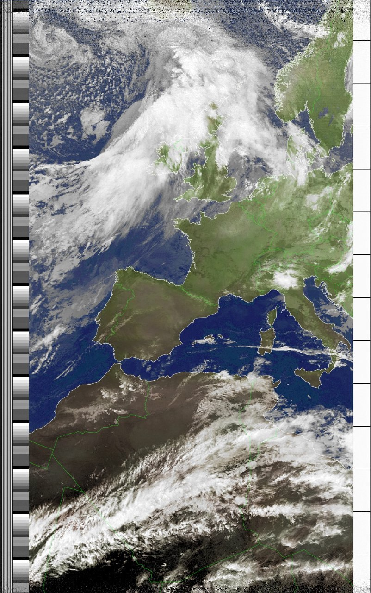

During the last months, in the RadioClub E.I.T. EA4RCT, we have benn planning to design from scratch and build an automates station for receiving both NOAA and Meteor satellites. This will be a completely Open-Source projects, which will be developped in Linux. 

Our main objectives are, on the hardware side, desingning a high quality antenna and bandpass filters, by performing the necessary simulations and tests before the final build. On the software side, we will provide a fully open-source program that will automatically receive every image transmitted by these satellites by tracking the corresponding satellite, receiving the signal, demodulating and decoding it and processing the final images. Moreover, it will allow users to control their station from anywhere in the world in case they want to operate it manually.

For a detailed guide about the project, I strongly recommend reading the official [project proposal](../assets/docs/posts/2020-02-03-EA4RCTProject/1.pdf). There, you will find some interesting aspects such as a bill of materials with budget and a link budget for these satellite communications!

As the manager of the project, I greatly encourage you to stay tuned to [our website](https://ea4rct.org/blog/2020-02-03-propuesta-automatizacion-noaa/), where we will be publishing both our intermediate results and the final project!

