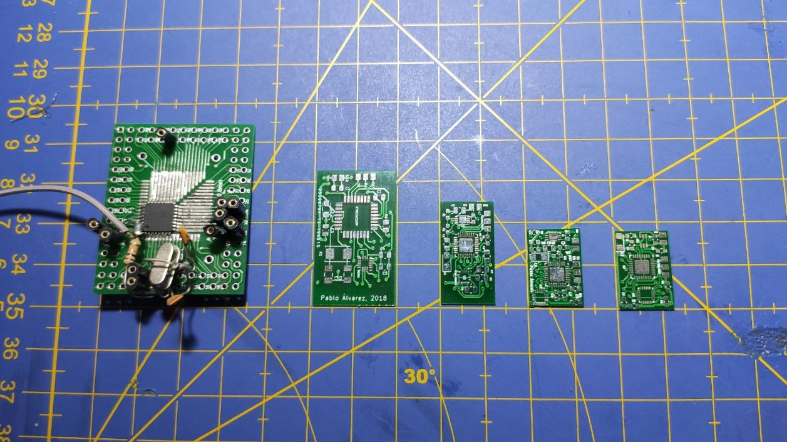
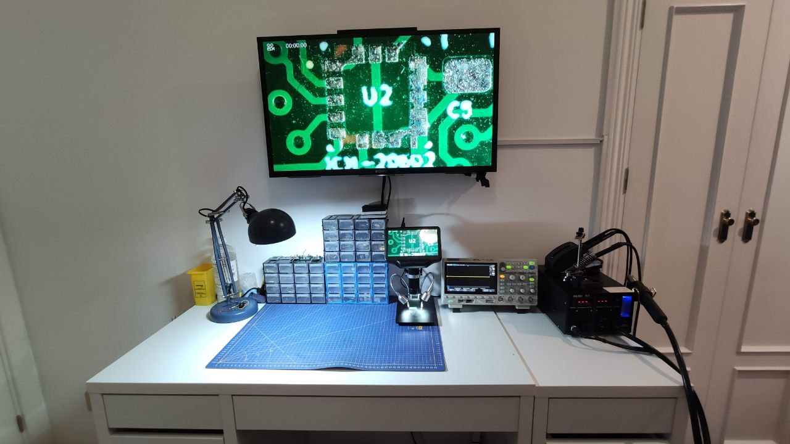
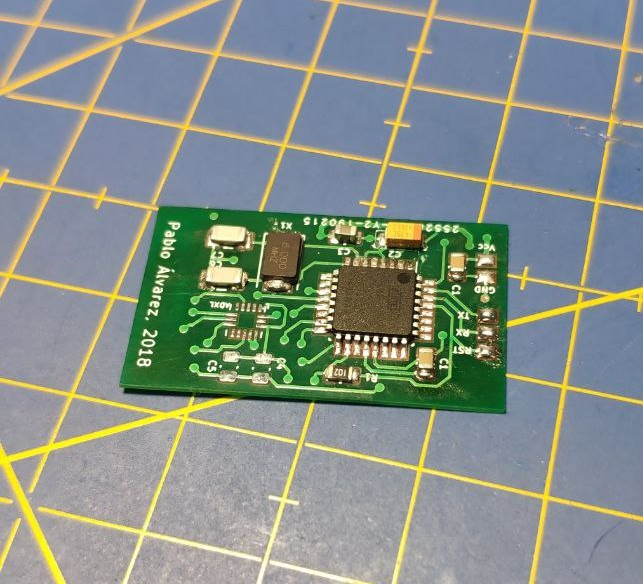
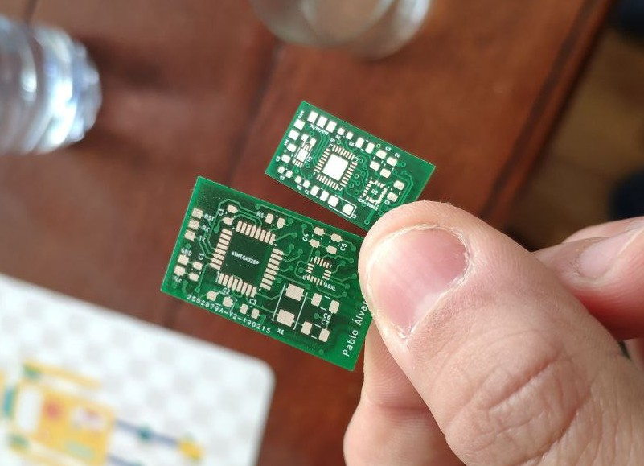
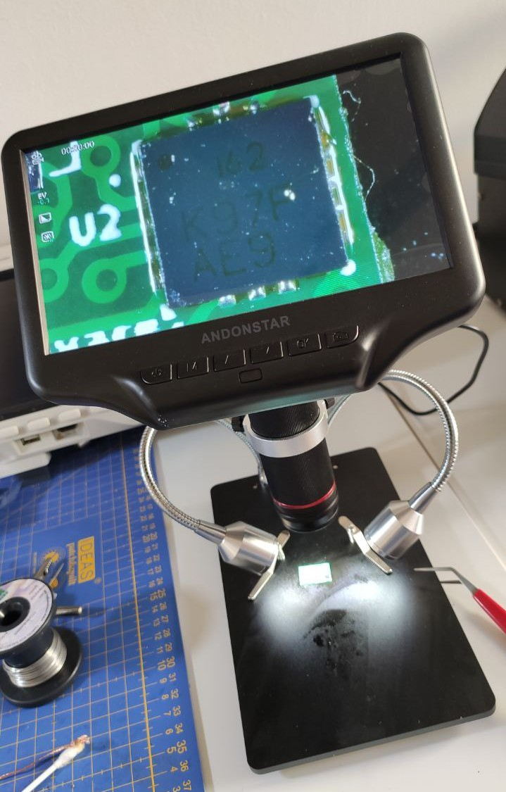
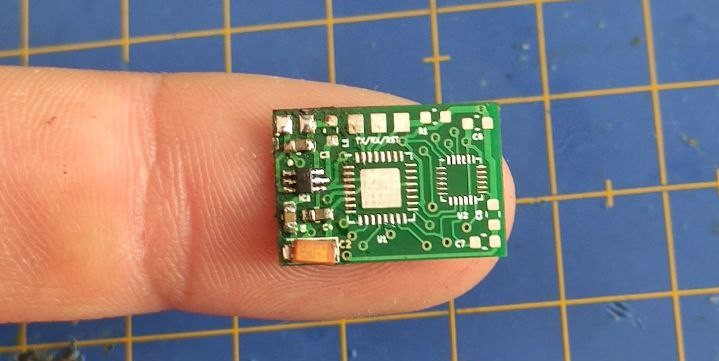
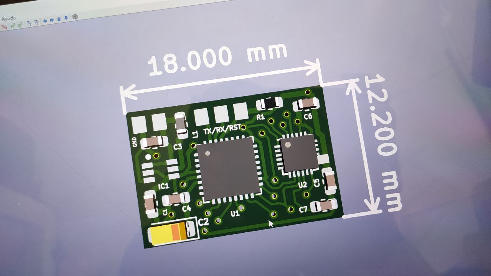
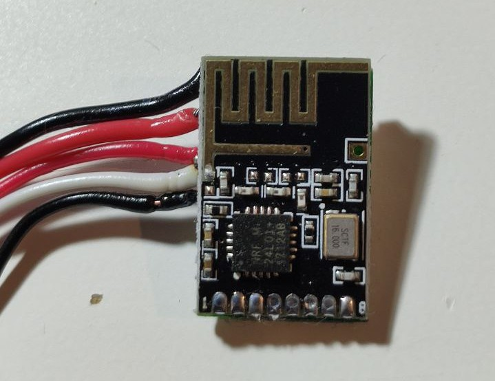
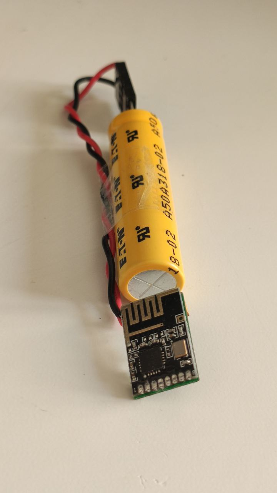

Remember the post I uploaded a while ago about developing an inalambric, ultra low power IMU? Well, so, during the last year, I have been working on a definitive version of that prototype. 

**TL;DR**: You can find both the code and the PCB files (gerbers and KiCAD project) in my [GitHub](https://github.com/pepassaco/pIMU). The final specs of the portable IMU are the following:

  - Input voltage range: 0,8V-3,5V
  - 16bit, low power IMU MPU9250
  - Low power 2,4GHz NRF24L01 transceiver
  - Power consumption of the whole system: 9mA when working and 1mA in standby!
  - Powered by a 34F supercapacitor, which offers 2h of battery life with charge time of seconds
  - PCB size of only 18x12mm!

In this post, I will cover a bit its features and the whole the developing process. 

## Version 0.2

(Recall that v0.1 was the prototype made out of arduino-like modules and an Arduino nano). The main objective of this version was getting rid of the Arduino Nano by designing a prototype board based on an Atmega-328p. This will help a lot for solving the power consumption issues, since we will be removing both the power regulator, the LEDs and the USB interface.

In order to *program* the device in this way, it is necessary to follow two main steps. First, we must burn a bootloader to the IC. This will only have to be done once. We can choose between the Arduino vanilla bootloader or other optimised versions like [Optiboot](https://github.com/Optiboot/optiboot). In my case, I went for installing Optiboot. For this step, you will need to have access to the SPI interface, so make sure you solder some wires to the corresponding pins.

The second step will be uploading our sketch in Arduino code. Once we already have the bootloader burnt, we will only have to connect the serial port on the uC to an FTDI adapter to program it.

For the hardware configuration, we will need the IC, some prototyping PCB to solder it onto (we will be using the QFN version of the Atmega328p), a 20MHz crystal oscillator and a couple of around 18pF capacitors. For more information about how to set up an stand alone uC running Arduino code, check the [official](https://www.arduino.cc/en/Tutorial/ArduinoToBreadboard) doccumentation.

After some time debugging small errors, I got a *blink* program working on the uC, so I decided to move on to designing a PCB.

## Version 0.3

The next step forward was the design of a PCB in order to pack all components in a single tiny boards, and get rid of those horrible cables. For that purpose, I used the open-source program Kicad. I did not have a lot of experience soldering these tiny boards, so I decided to go for an ATmega328-AU uC, 0805 decoupling capacitors, a [ICM20602](https://invensense.tdk.com/wp-content/uploads/2016/10/DS-000176-ICM-20602-v1.0.pdf) IMU and a NRF24L01 compact module.

The first PCB was just a revision of the 0.2 hardware were everything was fit into the same board: the Atmega uC, the clock with its capacitors, the IMU and the NRF24L01.

This was the (incomplete) result of this first design:

The next logical step was trying to remove that bulky crystal clock from there. After reading the datasheet of the Atmega, I realised that the chip itself has a built-in LC oscillator which can replace the external clock. This internal oscillator has lower precision, so it may not be accurate enought for strict time-dependent applications. Nevertheless, since our program does not require a very precise timing (SPI communication works seamlessly with this clock), I decided to activate it.

To select this oscillator as the default clock source, we must burn the uC fuses accordingly. Use any of the [online tools](https://eleccelerator.com/fusecalc/) available to get the correct fuse values, and then burn them by using a program called [avrdude](https://www.nongnu.org/avrdude/) for Windows. 

Alternatively, I found that the user Nick Gammon has a great tool called Atmega Board Programmer for both burning the bootloader and changing the fuses on a spare Atmega328p by using only an Arduino boards. This ended up being more convinient and fast that using a bootloader programmer and avrdude. You can find more information about this option [here](https://github.com/nickgammon/arduino_sketches). 

Another issue to be solved in a new version of the board is the inclusion of some type of voltage regulator, for being able to power the device by directly connecting a battery to it.

## Version 0.4

This version corrected the main two flaws the last version had: I removed both the crystal clock and the capacitors and added an [LTC3539](https://www.analog.com/media/en/technical-documentation/data-sheets/35392fc.pdf). 

I had the crazy idea of not powering the pIMU device with a battery, but with a supercapacitor! By using some advance power-saving techniques and low power ICs, it is possible to achieve up to 2h of autonomy with a capacitor, with a charge time of just about some seconds. The LTC3539 IC can accept input voltages of around -0.3V to 6V, and the output would be some fixed 3.3V. This will provide the necessary stable voltage the uC and the IMU need from the variable voltage from the capacitor.

In order to reduce the overall power consumption, I decided to replace the ICM20602 by an ultra low power [LIS3DH](https://www.google.com/url?sa=t&rct=j&q=&esrc=s&source=web&cd=&ved=2ahUKEwiDsYivnt3qAhXF5-AKHfORCLwQFjAAegQIAhAB&url=https%3A%2F%2Fwww.st.com%2Fresource%2Fen%2Fdatasheet%2Flis3dh.pdf&usg=AOvVaw2q9S1BwlP4OSbpoJCBQh7i). This IMU comes in an LGA package, which can be difficult to handsolder it.

With the aim or reducing the size of the device, I decided to upgrade the Atmega328p-au with a smaller Atmega328p-mu.

Once the PCBs arrived, I started to solder the different components and found some small design flaws. For example, the footprint of the LGA IC was designed for machine/furnace soldering, so the pads were too smalls for handsoldering the device. Also, the NRF24L01 did not fit well on the back of the PCB. Besides, some of the components were conecter to a power net that was in fact not connected to the real +3,3V source, so I had so solder some wire in order to solve it.

Nevertheless, I was able to program the Atmega328p (burn the bootloader with the SPI port and upload sketches with the UART solder pads I left) and got it working with the NRF24L01 module! Progress is slow, but little by little we are getting results!

## Version 0.5

This smaller version definitely solved the problem of the bad nets and the LTC3539: now, the board could be powered directly from a capacitor or a battery and both the Atmega328p and the NRF24L01 worked perfectly. Moreover, I edited the footprint of the LIS3DH in order to make it easier to solder.

However, I placed the LIS3DH too close to the edge of the board. This resulted in hours of tortures trying to solder the IC and keep it in place without success. After some days, I surrended and decided to order a new revision of the board.

Before ordering a new PCB, I took advantage of the need of sending a new version of the board to redesing it completely. For example, I decided to remove the LTC3539 and replace it by a [TLV61225](https://www.ti.com/lit/ds/symlink/tlv61225.pdf): while this device need 0,8V for outputing the necessary 3,3V (the LTC only needed 0,5V), it offers less quiescent current and better performance). Besides, I swapped the LIS3DH by an [MPU9250](https://invensense.tdk.com/wp-content/uploads/2015/02/PS-MPU-9250A-01-v1.1.pdf). Its low power mode can achieve current close to the ones provided by the LIS3DH, so power consumption should not become a problem. On the other hand, it is much easier to solder, which is great due to the difficulty I had soldering the LGA package.

## Version 0.6

Finally, a fully working hardware revision! Now, before finishing up this project, it was time to optimise its firmware to achieve the lowest power consume possible. For that purpose, the following tricks were used:

  - Disable the NRF24L01 when it is not sending data, and use its low power transmission mode
  - Select a low sampling frequency (50Hz) and low precision mode on the IMU, with the magetometer disabled too.
  - Sleep the uC between measurements. It wakes up from sleep with a WDT interrupt, reads the registers where the current data is stores in the IMU by SPI, wakes up the NRF, sends the data, turns the NRF off and returns to sleep.
  - Disable any non necessary feature of the Atmega, such as the ADC. See [this post](https://www.gammon.com.au/forum/?id=11497) for more details about this.
  - Disable or lower brown-out detection. This will ensure that our uC keeps working even at low input voltages.
  

  
## Version 1.0
  
After al lthese improvements were implemented succesfully, we had our portable IMU sensor working with the specs mentioned at the begining of the post. 

I would like to close this post with some images of the final revision of pIMU. Remember that both the code and the PCB gerbers and KiCAD project are available in my [GitHub](https://github.com/pepassaco/pIMU).

