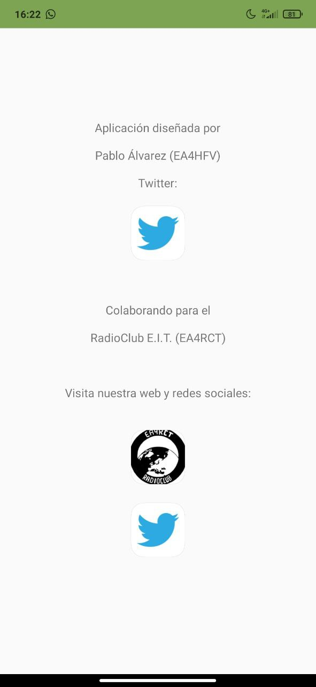
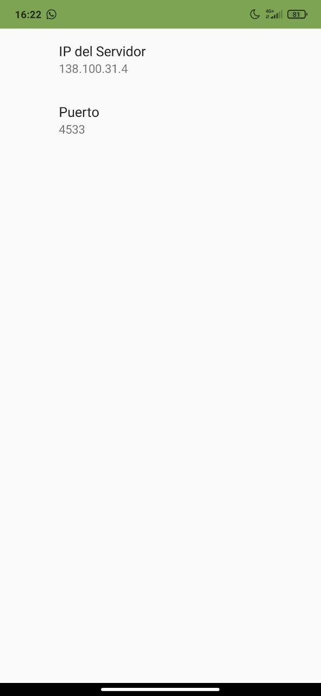

Debido a la actual situación en que nos encontramos (de cuarentena y sin poder salir de casa), nos es extremadamente difícil avanzar en el desarrollo de cualquier proyecto que implique el uso o diseño de hardware. Es por ello que decidimos aprovechar este periodo para la mejora de los servicios telemáticos del RadioClub (puesta a punto y actualización de servidores, automatización de tareas de mantenimiento, etc.). 

Durante una de estas tardes de desarrollo de software surgió la siguiente conversación: 

— Oye, pues estaría guapo poder mover las antenas desde el móvil.

— ¿Para qué?

— Para nada, pero estaría guapo

— La verdad que sí

Fue así como decidimos desarrollar una aplicación que se conectara al servidor de Hamlib al que se encuentra conectado el rotor de la estación de satélites, para ser capaz de controlarlo desde dispositivos Android.


## Funcionamiento de la aplicación

La aplicación desarrollada consta de 3 apartados: un socket TCP para la comunicación con el rotor, un sistema de predicción de los próximos satélites meteorológicos que se van a recibir desde el RadioClub (a fin de que el usuario no intente mover la antena durante el paso de un satélite entorpeciendo su recepción) y una pestaña de ajustes que nos permite modificar la dirección IP y puerto del servidor al que nos conectamos.

### Socket TCP

Para la creación de un socket TCP, basta crear una clase AsyncTask dentro de nuestra actividad principal (las tareas relacionadas con la comunicación en red no pueden ejecutarse en la misma hebra que la intefaz de usuario, de ahí la necesidad de declararla como AsyncTask). 

En nuestro caso, reutilizamos parte del código publicado en [este repositorio](https://github.com/dombrock-archive/TCPz-Android) (no es necesario reinventar la rueda), modificándolo para que en lugar de enviar mensajes arbitrarios, envíe los comandos necesarios para que nuestro servidor rotctld los reconozca. Estos comandos pueden consultarse desde [este enlace](http://manpages.ubuntu.com/manpages/xenial/man8/rotctld.8.html#commands). Concretamente, nos centraremos en los comandos *p* (get_position) y *P AZ EL* (set_position):


Cuando se pulse un botón en la aplicación de Android, se actualizará una variable booleana f correspondiente al botón pulsado y se llamará al método actualizaMensaje, el cual modifica la variable de clase msg en función del comando a enviar. Posteriormente, se llamará a sendMessage, encargado de ejecutar la AsyncTask del socket TCP:

```java=
public void sendMessage() {


        TextView textView = (TextView) findViewById(R.id.response);
        textView.setText("Loading...");
        Log.d("msg",msg);

        Log.d("Check Abort",Abort.toString());
        if(Abort) {
            lo.cancel(false);
            Log.d("Aborting",Abort.toString());
        }
        else {
            lo = new LongOperation();
            lo.execute();
        }
        Abort = true;

    }
```

Es importante tener en cuenta que cada usuario querrá conectarse a un rotor distinto, que estará conectado a un servidor con dirección IP diferente a la nuestra. Es por ello que tanto la IP como el puerto con los que se establece la conexión se almacenarán en las variables de clase *server_address* y *server_port* y se podrán modificar desde ajustes. 

```java=
protected String doInBackground(String... params) {

            socket = null;
            SocketAddress address = new InetSocketAddress(server_address, server_port);

            socket = new Socket();


            try {
                socket.connect(address, 1500);
            } catch (IOException e) {
                Log.d("time","no worky X");
                e.printStackTrace();
            }
            try {
                socket.setSoTimeout(250);
            } catch (SocketException e) {
                Log.d("timeout","server took too long to respond");

                e.printStackTrace();
                return "Can't Connect";
            }
```

### Actividad de ajustes para la modificación de parámetros

Para la creación del menú de ajustes recomendamos la lectura de este [tutorial](https://medium.com/@bhavyakaria/step-by-step-guide-to-create-app-settings-using-preferences-in-android-part-1-fa470305b530), que fue el que tuvimos en cuenta para el desarrollo de la aplicación.

Debemos crear, por un lado, una segunda actividad Settings hija de nuestra MainActivity, de forma que al finalizar Settings se vuelva a la interfaz principal. Por otro lado, serán necesarios unos objetos toolbar y menú en la interfaz de MainActivity, de forma que al pulsar sobre la barra de herramientas se despliegue un menú con opciones, entre las que se encontrará la de ajustes.

Una segunda clase llamada SettingsFragment se encargará del manejo del objeto SharedPreferences, donde se guardarán las preferencias del usuario. Este objeto se comparte entre las distintas clases, pudiendo leerse así los datos seleccionados en Ajustes desde nuestra actividad principal:

```java=
public class SettingsFragment extends PreferenceFragmentCompat implements SharedPreferences.OnSharedPreferenceChangeListener, Preference.OnPreferenceChangeListener {
    @Override
    public void onCreatePreferences(Bundle savedInstanceState, String rootKey) {
        addPreferencesFromResource(R.xml.settings_pref);

        SharedPreferences sharedPreferences = getPreferenceScreen().getSharedPreferences();
        PreferenceScreen prefScreen = getPreferenceScreen();

        int count = prefScreen.getPreferenceCount();

        // Go through all of the preferences, and set up their preference summary.
        for (int i = 0; i < count; i++) {
            Preference p = prefScreen.getPreference(i);
            // You don't need to set up preference summaries for checkbox preferences because
            // they are already set up in xml using summaryOff and summary On
            if (!(p instanceof CheckBoxPreference)) {
                String value = sharedPreferences.getString(p.getKey(), "");
                setPreferenceSummary(p, value);
            }
        }

        Preference preferenceS = findPreference(getString(R.string.pref_server_key));
        preferenceS.setOnPreferenceChangeListener(this);

        Preference preferenceP = findPreference(getString(R.string.pref_port_key));
        preferenceP.setOnPreferenceChangeListener(this);

    }
```


### Lectura de los próximos satélites

Es importante que lo usuarios de la aplicación tomen conciencia y eviten mover las antenas mientras se está recibiendo un satélite meteorológico. Para identificar cuándo se recibirá uno de setos satélites, aprovechamos que sabemos de antemano que la estación captará automáticamente aquellos pasos de los satélites NOAA 15, 18 y 19 y Meteor M-N2 de más de 20º de elevación. Para obtener estos pasos, se pueden seguir dos caminos distintos: descargar los archivos TLE (Two Line Element) de cada satélite y realizar los cálculos pertinentes para obtener la órbita del satélite o conectarse a una API externa que ofrezca dicha información. En nuestro caso, optamos por la segunda opción, utilizando la [API de N2YO](https://www.n2yo.com/api/). 

Obtener los datos que buscamos es extremadamente sencillo gracias a esta herramienta. Sólo necesitamos realizar una petición GET con el formato que nos indica la documentación y se nos devolverá un objeto JSON con los datos requeridos. Además, nos permite filtrar pasos según su elevación máxima, ahorrándonos el trabajo de tener que realizar el filtrado manualmente.

La respuesta a una petición GET por parte del servidor tendrá la siguiente forma:


Se trata de un JSONArray de 2 elementos (info y passes), donde a su vez passes es otro JSONArray con la información que buscamos. Para recibir el objeto y quedarnos sólo con los pasos, utilizaremos el siguiente código:

```java=
        String N15 = getResponse(URL_1+NOAA_15+URL_2+API_KEY);
        String N18 = getResponse(URL_1+NOAA_18+URL_2+API_KEY);
        String N19 = getResponse(URL_1+NOAA_19+URL_2+API_KEY);
        String MN2 = getResponse(URL_1+METEOR_M2+URL_2+API_KEY);

        try {
            JSONObject J1N15 = new JSONObject(N15);
            JSONObject J1N18 = new JSONObject(N18);
            JSONObject J1N19 = new JSONObject(N19);
            JSONObject J1MN2 = new JSONObject(MN2);

            Log.d("msg",J1N15.toString());

            JSONArray JN15Ar = new JSONArray(J1N15.getString("passes"));
            JSONArray JN18Ar = new JSONArray(J1N18.getString("passes"));
            JSONArray JN19Ar = new JSONArray(J1N19.getString("passes"));
            JSONArray JMN2Ar = new JSONArray(J1MN2.getString("passes"));

            Log.d("msg",JN15Ar.toString());

            JSONObject JN15 = JN15Ar.getJSONObject(0);
            JSONObject JN18 = JN18Ar.getJSONObject(0);
            JSONObject JN19 = JN19Ar.getJSONObject(0);
            JSONObject JMN2 = JMN2Ar.getJSONObject(0);
```

Donde el método getResponse se encarga de realizar la petición:

```java=
private String getResponse(String endpoint) {
        HttpHelper helper = new HttpHelper();
        String result = "";
        try {
            result = helper.execute(endpoint).get();
        } catch (InterruptedException | ExecutionException e) {
            e.printStackTrace();
        }
        responseCode = HttpHelper.getResponseCode();
        return result;
    }
```


Una vez hecho esto, debemos tomar el valor de los campos *startUTC* y *endUTC* y convertirlos de formato de fecha UNIX a un formato estándar:

```java=
long AOS_N15 = Long.parseLong(JN15.getString("startUTC"),10) * (long) 1000;
            long AOS_N18 = Long.parseLong(JN18.getString("startUTC"),10) * (long) 1000;
            long AOS_N19 = Long.parseLong(JN19.getString("startUTC"),10) * (long) 1000;
            long AOS_MN2 = Long.parseLong(JMN2.getString("startUTC"),10) * (long) 1000;

            Date tAOS_N15 = new Date(AOS_N15);
            Date tAOS_N18 = new Date(AOS_N18);
            Date tAOS_N19 = new Date(AOS_N19);
            Date tAOS_MN2 = new Date(AOS_MN2);


            long LOS_N15 = Long.parseLong(JN15.getString("endUTC"),10) * (long) 1000;
            long LOS_N18 = Long.parseLong(JN18.getString("endUTC"),10) * (long) 1000;
            long LOS_N19 = Long.parseLong(JN19.getString("endUTC"),10) * (long) 1000;
            long LOS_MN2 = Long.parseLong(JMN2.getString("endUTC"),10) * (long) 1000;

            Date tLOS_N15 = new Date(LOS_N15);
            Date tLOS_N18 = new Date(LOS_N18);
            Date tLOS_N19 = new Date(LOS_N19);
            Date tLOS_MN2 = new Date(LOS_MN2);


            SimpleDateFormat format1 = new SimpleDateFormat("MMM dd HH:mm:ss");
            format1.setTimeZone(TimeZone.getTimeZone("CET"));

            SimpleDateFormat format2 = new SimpleDateFormat("HH:mm:ss");
            format2.setTimeZone(TimeZone.getTimeZone("CET"));

            Log.d("date", format1.format(AOS_N15));

            return ("Siguientes pasos:\n\nNOAA 15:\nAOS: " + format2.format(tAOS_N15) + "    LOS:  " + format2.format(tLOS_N15) + "\n\nNOAA 18:\nAOS: " + format2.format(tAOS_N18) + "    LOS:  " + format2.format(tLOS_N18) + "\n\nNOAA 19:\nAOS: " + format2.format(tAOS_N19) + "    LOS:  " + format2.format(tLOS_N19) + "\n\nMeteor M2:\nAOS: " + format2.format(tAOS_MN2) + "    LOS:  " + format2.format(tLOS_MN2));
```

Finalmente, se sacarán estos datos por pantalla.

## Descarga de la aplicación

Toda la información relacionada con la app se puede encontrar en su [repositorio de Gitea](https://git.radio.clubs.etsit.upm.es/Pablo/ControlAntenas_Android). 

No sólo encontrarás el archivo .apk para la instalación, sino todo el código fuente de la applicación y los archivos necesarios para la importación del proyecto desde Android Studio.

## Conclusión

Graacias a este proyecto aprendimos a implementar comunicaciones en red en aplicaciones android (tanto peticiones web como sockets). Si bien su utilidad práctica parece reducida, no deja de ser una forma más de intentar modernizar los equipos de radio, adaptándolos a los tiempos actuales. 

Esperamos que demostraciones de esta aplicación ayuden también a generar un interés hacia el RadioClub y la radioafición por parte de estudiantes de nuevo ingreso o jóvenes a los que les atraigan las nuevas tecnologías.


*~mamado@ea4rct*





