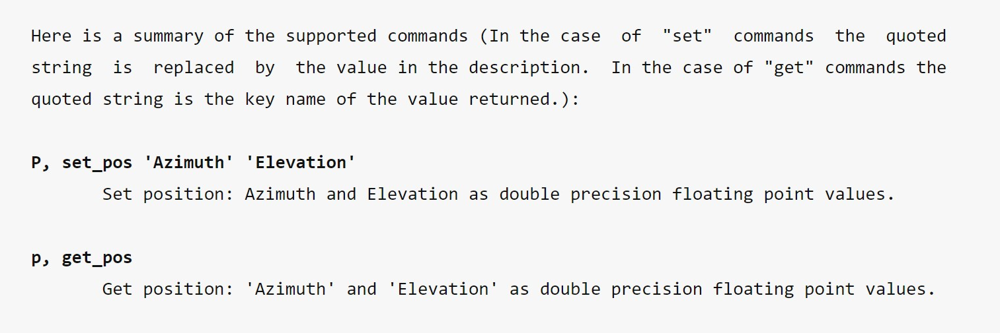
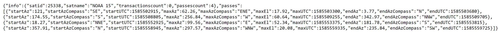

**TL;DR**: You can find an app to control antenna rotators connected to a Hamlib served from any Android phone in my [GitHub](https://github.com/pepassaco/HamlibAndroid). 

Due to the actual situation we are living (in a lockdown and without access to the University or electronics stores), it is extremely difficult to advance in any hardware-related project. It is mainly because of this that I tried to use this time to improve some of the telematic services we provide in the RadioClub EA4RCT. 

During one of these maintenances, I had the following conversation with a mate:

*Me:* Hey, it would be cool being able to move the antennas from our mobile phones

*Him:* What for?

*Me:* Its useless, but it would be cool

*Him:* Well, that's true.

It was like this that I decided to develop an Android app capable of connecting to the Hamlib server the antennas of our university are connected to. Like this, we would be able to control them remotely from a phone! Seemed cool.


## How it works

The developed app is made out of 3 main parts: a TCP socket for the communication with the rotator, a prediction/tracking system to see there the next meteorological satellites have a pass (in order to avoind getting control of the satellite station while we are receiving a signal) and a settings tab to change both the IP address and the port we wat to connect the app to.

### TCP Socket 

For creating the TCP Socket, we just need to create an AsyncTask inside our main activity (it is not possible to exewcute network related tasks inside the user interface activity directly). 

In this case, we will use some of the code publish in [this repository](https://github.com/dombrock-archive/TCPz-Android) (it is not needed to reinvent the wheel), applying some modifications for that, instead of sending arbitrary messages, send the necessary commands to be understood by our *rotctld* (Hamlib rotator controller) server. These commands can be checked from [the official website](http://manpages.ubuntu.com/manpages/xenial/man8/rotctld.8.html#commands). More precisely, we will be centered in the commands *p* (get_position) and *P AZ EL* (set_position):



Once the Android app detects that a button has been pressed, a boolean variable called *f* (corresponding to the pressed button) will be updated. Then, the method *actualizaMensaje* will be called, where the class variable *msg* is modified depending on the text to be sent. Later, we call *sendMessage*, which executes the AsyncTask of the TCP Socket:

```java=
public void sendMessage() {


        TextView textView = (TextView) findViewById(R.id.response);
        textView.setText("Loading...");
        Log.d("msg",msg);

        Log.d("Check Abort",Abort.toString());
        if(Abort) {
            lo.cancel(false);
            Log.d("Aborting",Abort.toString());
        }
        else {
            lo = new LongOperation();
            lo.execute();
        }
        Abort = true;

    }
```

It is important to take into account that each user will want to connect the app to a different rotator, which will at the same time be controlled by a different Hamlib server with a different IP address. To provide compatibility with all server, both the server address and its port will be saved in the class variables *server_address* and *server_port* , which will be adjustable in the settings tab:

```java=
protected String doInBackground(String... params) {

            socket = null;
            SocketAddress address = new InetSocketAddress(server_address, server_port);

            socket = new Socket();


            try {
                socket.connect(address, 1500);
            } catch (IOException e) {
                Log.d("time","no worky X");
                e.printStackTrace();
            }
            try {
                socket.setSoTimeout(250);
            } catch (SocketException e) {
                Log.d("timeout","server took too long to respond");

                e.printStackTrace();
                return "Can't Connect";
            }
```

### Settings activity to modify some parameters


For creating a settings menu, I would recommend reading the following [tutorial](https://medium.com/@bhavyakaria/step-by-step-guide-to-create-app-settings-using-preferences-in-android-part-1-fa470305b530), which was the one that helped me the most for developing this app.

We must create, on the one hand, a second activity named Settings, daughter of our MainActivity, so that once Settings finishes we get returned to the previous screen. On the other hand, we will need some Toolbar and Menu objects on the MainActivity activity, so that pressing the toolbar shows a menu with some options, one of which will be Settings.

A second call called SettingsFragment will be in charge of managing a SharedPreferences object, where the user preferences will be saved. This object will be sshared between the different classes, allowing us to read the parameters selected in Settings from our main activity,:

```java=
public class SettingsFragment extends PreferenceFragmentCompat implements SharedPreferences.OnSharedPreferenceChangeListener, Preference.OnPreferenceChangeListener {
    @Override
    public void onCreatePreferences(Bundle savedInstanceState, String rootKey) {
        addPreferencesFromResource(R.xml.settings_pref);

        SharedPreferences sharedPreferences = getPreferenceScreen().getSharedPreferences();
        PreferenceScreen prefScreen = getPreferenceScreen();

        int count = prefScreen.getPreferenceCount();

        // Go through all of the preferences, and set up their preference summary.
        for (int i = 0; i < count; i++) {
            Preference p = prefScreen.getPreference(i);
            // You don't need to set up preference summaries for checkbox preferences because
            // they are already set up in xml using summaryOff and summary On
            if (!(p instanceof CheckBoxPreference)) {
                String value = sharedPreferences.getString(p.getKey(), "");
                setPreferenceSummary(p, value);
            }
        }

        Preference preferenceS = findPreference(getString(R.string.pref_server_key));
        preferenceS.setOnPreferenceChangeListener(this);

        Preference preferenceP = findPreference(getString(R.string.pref_port_key));
        preferenceP.setOnPreferenceChangeListener(this);

    }
```


### Reading the next satellite passes

At the EA4RCT, it is important for the users to take into account that, if they try to move the antenna while a satellite is being tracked, they can ruin the reception (we have not implemented a priority-like system yet). In order to identify when the station will be receiving one of these satellites, we take advantage of the fact that we know that the only tracked passes are the ones from NOAA 15, 18, 19 and Meteor M2 with more than 20º of elevation. In order to get these passes in our phone, we can choose two different ways: downloading the Two-Line Element (TLE) files of each satellite and computing their trajectory to calculate when will the next AOS and LOS be, or connecting to an API that directly gives us that information. In this case, I chose the second option, since it was the easiest and fastest, and can achieve good results. For this, I went for the [N2YO API](https://www.n2yo.com/api/). 

Obtaining the data we are searching for is extremely easy thanks to this tool. We just need to make a GET request with the format required by the API and we will be given a JSON file with all the requested data. Besides, it allows us to filtrate the passes depending on its maximum elevation, so we do not have to implement this filter manually.

The response to a GET request to the API will look like the following:



It is a JSONArray of 2 elementos (info and passes), where, at the same time, passes is another JSONArray that contains the information we are looking for. To received this last object and extract the information about the passes we will do the following:

```java=
        String N15 = getResponse(URL_1+NOAA_15+URL_2+API_KEY);
        String N18 = getResponse(URL_1+NOAA_18+URL_2+API_KEY);
        String N19 = getResponse(URL_1+NOAA_19+URL_2+API_KEY);
        String MN2 = getResponse(URL_1+METEOR_M2+URL_2+API_KEY);

        try {
            JSONObject J1N15 = new JSONObject(N15);
            JSONObject J1N18 = new JSONObject(N18);
            JSONObject J1N19 = new JSONObject(N19);
            JSONObject J1MN2 = new JSONObject(MN2);

            Log.d("msg",J1N15.toString());

            JSONArray JN15Ar = new JSONArray(J1N15.getString("passes"));
            JSONArray JN18Ar = new JSONArray(J1N18.getString("passes"));
            JSONArray JN19Ar = new JSONArray(J1N19.getString("passes"));
            JSONArray JMN2Ar = new JSONArray(J1MN2.getString("passes"));

            Log.d("msg",JN15Ar.toString());

            JSONObject JN15 = JN15Ar.getJSONObject(0);
            JSONObject JN18 = JN18Ar.getJSONObject(0);
            JSONObject JN19 = JN19Ar.getJSONObject(0);
            JSONObject JMN2 = JMN2Ar.getJSONObject(0);
```

Where the getResponse method is in charge of sending the GET request:

```java=
private String getResponse(String endpoint) {
        HttpHelper helper = new HttpHelper();
        String result = "";
        try {
            result = helper.execute(endpoint).get();
        } catch (InterruptedException | ExecutionException e) {
            e.printStackTrace();
        }
        responseCode = HttpHelper.getResponseCode();
        return result;
    }
```


Once we have finished this up, we must take the value from the fields *startUTC* and *endUTC* and convert them from UNIX data format to a standard format:

```java=
long AOS_N15 = Long.parseLong(JN15.getString("startUTC"),10) * (long) 1000;
            long AOS_N18 = Long.parseLong(JN18.getString("startUTC"),10) * (long) 1000;
            long AOS_N19 = Long.parseLong(JN19.getString("startUTC"),10) * (long) 1000;
            long AOS_MN2 = Long.parseLong(JMN2.getString("startUTC"),10) * (long) 1000;

            Date tAOS_N15 = new Date(AOS_N15);
            Date tAOS_N18 = new Date(AOS_N18);
            Date tAOS_N19 = new Date(AOS_N19);
            Date tAOS_MN2 = new Date(AOS_MN2);


            long LOS_N15 = Long.parseLong(JN15.getString("endUTC"),10) * (long) 1000;
            long LOS_N18 = Long.parseLong(JN18.getString("endUTC"),10) * (long) 1000;
            long LOS_N19 = Long.parseLong(JN19.getString("endUTC"),10) * (long) 1000;
            long LOS_MN2 = Long.parseLong(JMN2.getString("endUTC"),10) * (long) 1000;

            Date tLOS_N15 = new Date(LOS_N15);
            Date tLOS_N18 = new Date(LOS_N18);
            Date tLOS_N19 = new Date(LOS_N19);
            Date tLOS_MN2 = new Date(LOS_MN2);


            SimpleDateFormat format1 = new SimpleDateFormat("MMM dd HH:mm:ss");
            format1.setTimeZone(TimeZone.getTimeZone("CET"));

            SimpleDateFormat format2 = new SimpleDateFormat("HH:mm:ss");
            format2.setTimeZone(TimeZone.getTimeZone("CET"));

            Log.d("date", format1.format(AOS_N15));

            return ("Siguientes pasos:\n\nNOAA 15:\nAOS: " + format2.format(tAOS_N15) + "    LOS:  " + format2.format(tLOS_N15) + "\n\nNOAA 18:\nAOS: " + format2.format(tAOS_N18) + "    LOS:  " + format2.format(tLOS_N18) + "\n\nNOAA 19:\nAOS: " + format2.format(tAOS_N19) + "    LOS:  " + format2.format(tLOS_N19) + "\n\nMeteor M2:\nAOS: " + format2.format(tAOS_MN2) + "    LOS:  " + format2.format(tLOS_MN2));
```

Finally, these data will be printed on screen.

## Downloading the application

All the technical information related to this app can be found free in my [GitHub](https://github.com/pepassaco/HamlibAndroid). 

Moreover, I have uploaded the whole Android Studio project, so that anyone can directly download it and start editing or modifying the app according to their needs.

## Conclusion

Thanks to this project, I learnt to implement network communications in an Android app (both HTTP petitions and Sockets). While its practical utility seems a bit reduced, it is nothing but a way of trying to modernise all the old-fashined radio equipment we have in our RadioClub.


