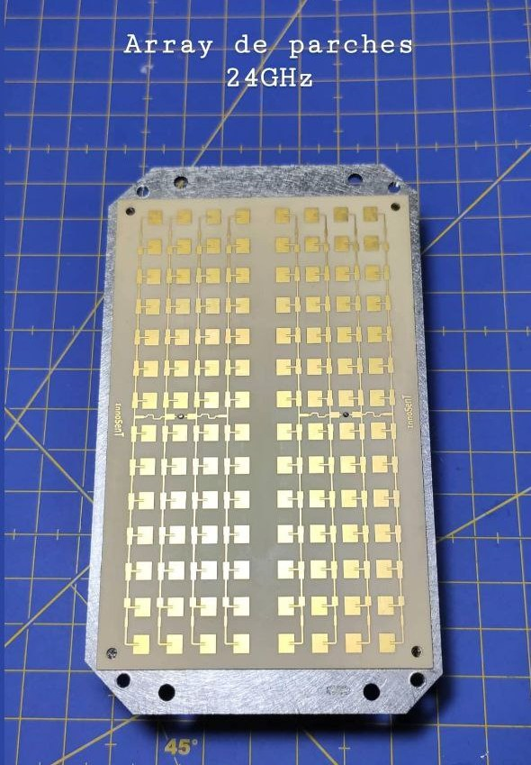
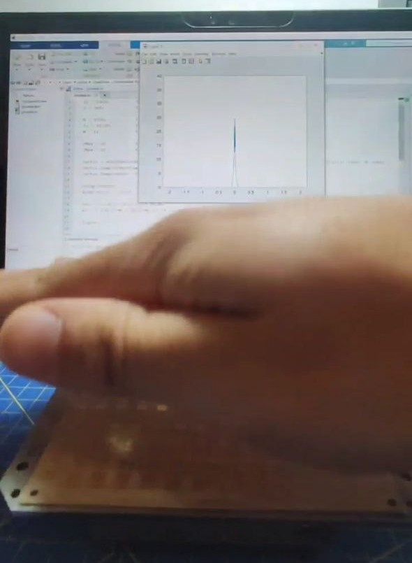

Due to the success of my 1.7GHz radar project, a friend of mine lent me a 24GHz radar module to test it! However, it did not include any documentation nor software, so I had to design my own!

## Hardware

The main piece of hardware is, of course, the 24GHz Radar, labeled as an InnoSent IVS-979. As you can see in the first image, it has two antennae arrays, one for TX and one for RX. It also has some IO pins at one side, with what could be a serial interface to controle the device. However, [this](https://www.innosent.de/fileadmin/media/dokumente/DATASHEETS_2016/Datenblatt_IVS-979.pdf) was the only datasheet I found online, and it does not include anything about registers or any specification on serial communication. It was a pitty, since this reduced a lot the possibilities of playing with the radar itself.



Nevertheless, two of the output pins were labeled as *Q-SIGNAL* and *I-SIGNAL*, what let us extract the doppler signal and work with it. 

Note that this radar works at a frequency of 24GHz. This means that the highest doppler frequencies we will obtain will be, for an object moving at 35m/s (126Km/h),

$$f_d \approx 2v\frac{f_{TX}}{c} = 2·35\frac{2.4·10^{10}}{3·10^8} = 5600$$

In order to sample a signal of a frequency lower than 6KHz like this one, we do not need to use any SDR: we can just take advantage of the sound card of the PC! Then, the only hardware we will need is a cable to connect the output of the radar to either the mic or the line input of the PC.

## Software

Once again, we will have to develop the necessary software with the signal processing stages from scratch. For this, we will use Matlab, sampling with the sound card the doppler signal and processing it afterwards.

Lets start coding.

First, as allways, we define the necessary variables, and, in this case, initialitate the sound card sampler:

```python=
fc = 24e9;          % Carrier frequency
c = 3e8;            % c

N = 4096;           % DFT window length
fs = 44100;         % Sampling frequency
M = 1;              % Downsampling factor

vMax = 0;           % Max value read
fMax = 0;           % IMax doppler frequency read

lector = audioDeviceReader;	% Configure the sound card as
lector.SamplesPerFrame = N;	% sampler and digitizer
lector.SampleRate = fs;

setup(lector)
disp('Micro listo')

x2 = ( (-N/(2*M)):(N/(2*M)-1) )* fs/(M*N);            %FFT vector after decimation

figure
```

Then, we must create a loop for working with the data that is being aquired. We will just need to decimate the original signal, calculate its DFT and its magnitude spectrum, find the maximum and its corresponding frequency and calculate the corresponding speed:

```python=
data = lector();	% Read new data
dataDiez = decimate(data, M);	% Apply a decimation
    
y2 = 10*log10(abs(fftshift(fft(dataDiez))));	% Obtain the DFT
    
[mx, I] = max(y2);	% Find its maximum
if abs(x2(I)) > fMax && mx > 15	% If it is a valid parameter, calculate speed
    fMax = abs(x2(I));
    vMax = fMax/2*c/fc;
end

disp(['Velocidad maxima: ', num2str(vMax), 'm/s = ', num2str(vMax*3.6), 'km/h'])

plot(x2,y2);
axis([-fs/(2*M^2) fs/(2*M^2) 5 40]);
drawnow
```
## Results

The radar works flawlessly, and this small Matlab script gives us some accurate measurement of the speed of an object. 

If you are curious about how the doppler signal looks like or sound (frequencies between 20Hz and 6KHz are of course audible by the human earing), take a look at [this example wav file](https://github.com/pepassaco/HomemadeRadars/blob/master/24GHz/doppler-signal-example.wav) with a recording of me moving my hand towards the radar. 



