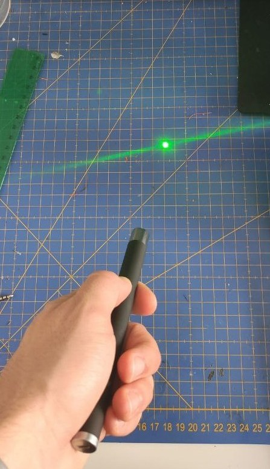
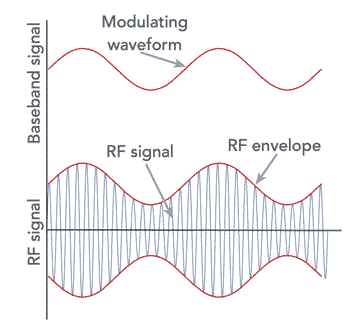
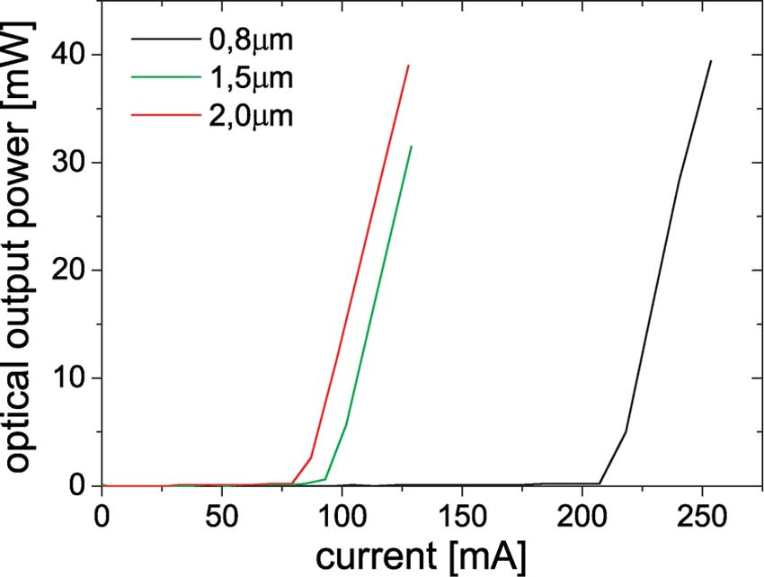
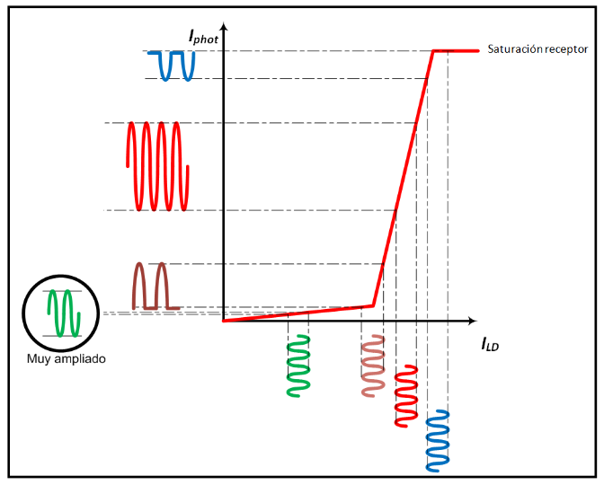
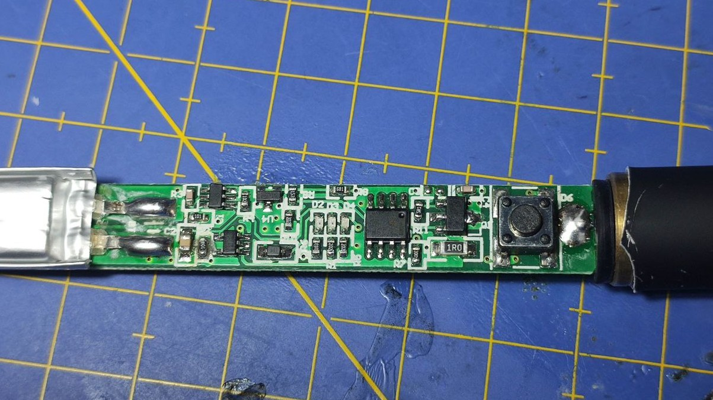
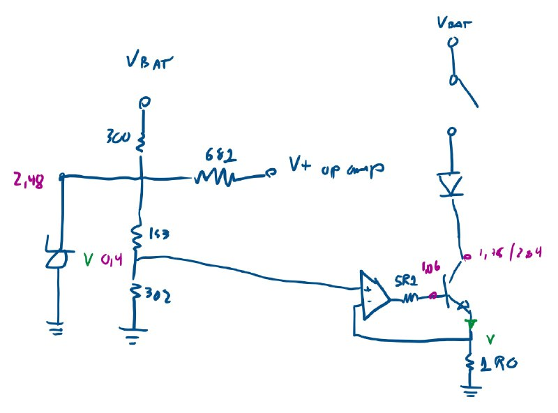
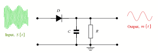
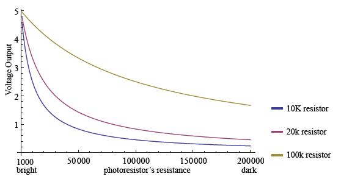
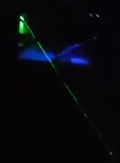
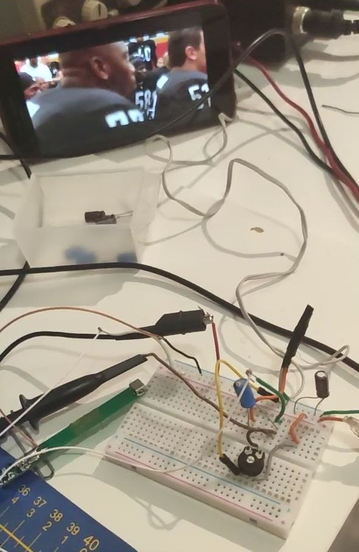

Today, I bring something completely different to anything compared to anything I have ever done. This time, I will be working with radio waves, but at a much higher frequency: I will be trying to modulate light!

## Modulation

### AM modulation

In this project, I will be trying to modulate a LASER sorce of light by using Amplitude Modulation (AM). While everybody knows AM for its use in SW, MW and LW bands (lower than 1MHz) , we will replicar it use at frequencies of around 580THz, just some $$5.8·10^8$$ times higher. 

Independently on the frequency of operation, the AM working principle is the same: let $$A_mx(t)$$ be our original passband signal, then, the frequency modulated in amplitude at a frequency $$\omega_c$$ would be:

$$y(t)=(A_c+A_mx(t))cos(\omega_ct)$$

Calculating the Fourier Transform of this modulated signal would yield a delta at the frequency of the carrier and two symmetrical (in the case of a real signal) bands around it. 

As you can see, the carrier frequency does not take any importal role; it's just an isolated parameter. Then, if we had the necessary technology, we could choose it to lay in the visible spectrum and send some AM radio emissions there!

## Designing the modulator

In order to build the modulator, we must first mention how a laser behaves with respect to its input power. Lasers are devices that can be characterised by its P-I curve: a transfer function relating the output optical power with its current drain. This curve has the following shape:

Note how it is almost flat at the begining until it resembles a straight line with a relatively high slope. The first section corresponds to light produced by spontaneous emission, since there is not enought current flowing thought the LASER. However, by increasing this current, the souce of light will start producing stimulated emission, and its optcal power will rocket up linearly. The current from which this phenomena starts happening is called threshold current.

Recall that, in order to produce an AM modulation, we need to modify the amplitude of a source of a ocnstant frequency. Since in our case this amplitude will directly be related to the optical power, and this parameter depends linearly on the current flowing throught the LASER, we just need to convert our modulating signal into current and feed the laser with it to achive the modulation wanted! However, typical audio outputs from both microphones and electronic devices convert audio signal into voltage, so all we need is a circuit to transform this voltage signal into current and we should be done. Or not?

If we just fed this current into the laser, the output optical signal would be completely distored. This is because of the previous explanaition about the P-I curve of a LASER: injecting a direct AC current into it would only "turn on" (produce stimulated emission) the light when it reaches levels above the threshold current. We need to add first a DC bias in order to polarise the LASER and, then, make sure that the amplitude of the current is low enought for ensuring it does no get lower than this threshold current. 

## Building the modulator

As stated previously, we need:

 - A voltage regulator to attenuate the input signal sufficiently.
 - A voltage to current converter.
 - A DC bias.
 
The LASER I bought, as the majority of available laser pointers, is powered directly from one or two batteries, which provice some constant voltage. This voltage must be converted into current for the correct opperation of the diode (directly connectiong a voltage source to a diode can burn it), so these commercial lasers include some sort of voltage to current converter inside.

Luckily, mine was not an exception. I picked up a multimeter and reversed engineered the circuit, which, as I predicted, was a voltage to current converter based on an operational amplifier. After finding the right sport to input the audio voltage signal with a DC bias, we already had a working light modulator!

## Demodulation

### AM demodulation

There are plenty of ways of demodulation an AM signal. However, the asiest and cheapest, and the one used traditionally by most radio receivers, is an envelope detector. An envelope detector is nothing but a diode followed by a capacitor or an RC lowpass filter. In this way, the resulting signal at the output would be the envelope that, in the case of an AM modulation, is the same as the modulated signal.

In spite of that, things are not that easy at these high frequencies. First, we would need a way to convert that modulated light into voltage, which is not possible nowadays. And then, no discrete component would stand a THz frequency. We must then try some different alternatives.

We need a device that takes light as an input and outputs a voltage **linearly** proportional to the optical power received. The perfect match for this necessity would be a photodiode, either PIN or APD. Nevertheless, I did not have any at home, and, because of the current lockdown, it was impossible for me to get any, so I decided to try another component I had laying around: a photoresistor.

### Designing and building the demodulator

Photoresistors may be one of the worst options for this project, since they have pretty slow reaction times and do not offer a linear transfer funcion:

Nonetheless, I decided to try it, since it was my only option.

The circuit I designed was pretty simple: a voltage source powers the photoresistor in series with another resistor, creating a voltage divider. Between both of them, a wire is connected to an audio amplifyer circuit based on the famous LM386. The output of this amplifyer is connected to an earphone.

## Results

Since I understood sufficiently well the theory behind this project, it was not difficult for me to debug it solve the small errors I found while building it. after some small corrections, I got it working flawlessly!

The audio heard at the receiver it pretty clean and understable. It is a litlle bit bandpass (no loud basses nor high pitches) due to the photoresistor, but the overall result was surprisingly good. 

I really liked this project and would like to work a bit more on it. In order to improve it further, the next stept I would like to take are:

 - Designing my own transmitter circuit
 - Replacing the LASER by som LEDs (better propagation due to scintillation)
 - Replacing the photoresistor by a photodiode
 

