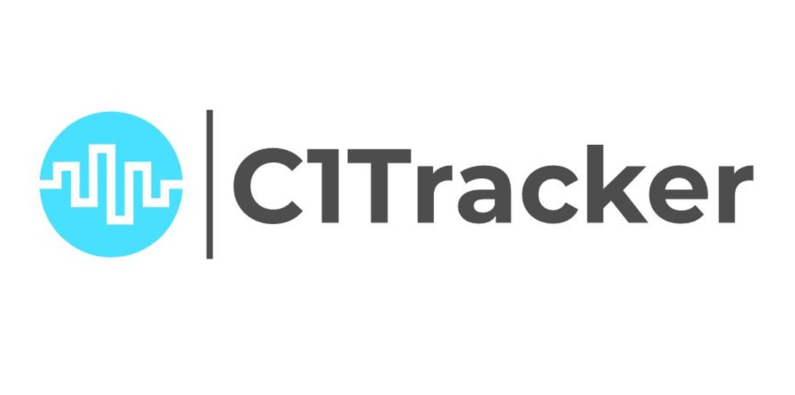
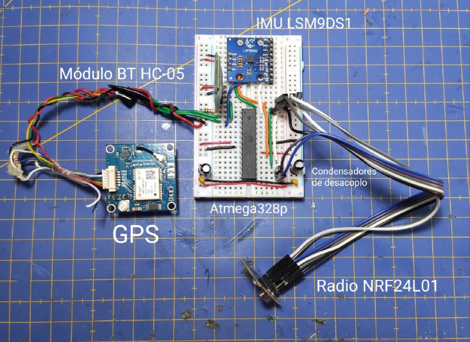
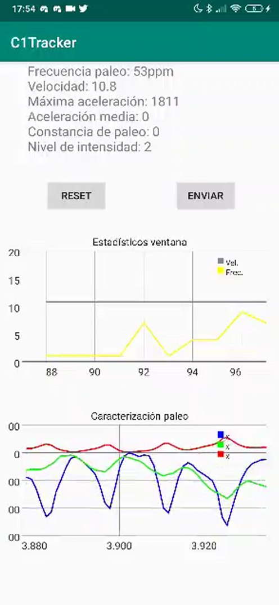

This semester, we had a course at University called "Digital Systems II". It as a 100% practical course, where we were given the opportunity to either build and develop a project proposed by the deppartment or design our own from scratch. Me teammate Angel Domínguez and me decided to take the second path, and I will cover that project on this post.

## The project itself

We decided to take an existing device I designed recently (the pIMU) and develop some type of sport-related ecosystem. I am a canoeist, and he does not practise any professional sport, so we chose focusing on sprint canoeing.

Our goal was the following: we had to develop a second unit of hardware to receive data from the pIMU and other sensors, send this data to another device to process it, interpret it and plot the desired parameters and upload these results to a server.

We ended up using an Atmega328p to receive the corresponding data and send it by Bluetooth to an android device, for which I would develop an app. This app was in charge of processing the data, extracting useful information from it by calculating statistical parameters and applying a k-means algorithm, and ploting in live graphics the results. Finally, some of the calculated statistics would be sent to a thinkspeak server in order to save the results of the training and keep a registry of the progression of the athlete.

## Detailed documentation

Since this was part of an University project, we had to write an extent document with all the information regarding both its functioning, development and specifications. 

You can find all the documentation [here](../assets/docs/posts/2020-05-23-SDG2/1.pdf).

It may seem a long file, but it is pretty easy to follow since every aspect of the project is thoroughly explained.

Unfortunately, we are not allowed to publish the full code on GitHub due to the strict norms of this course.
