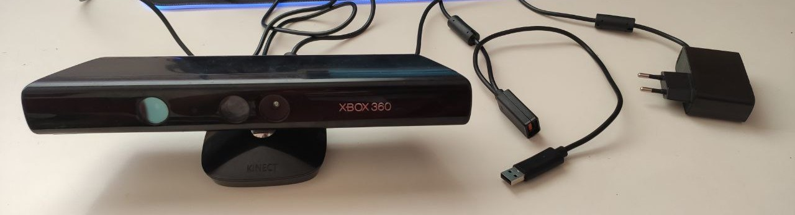
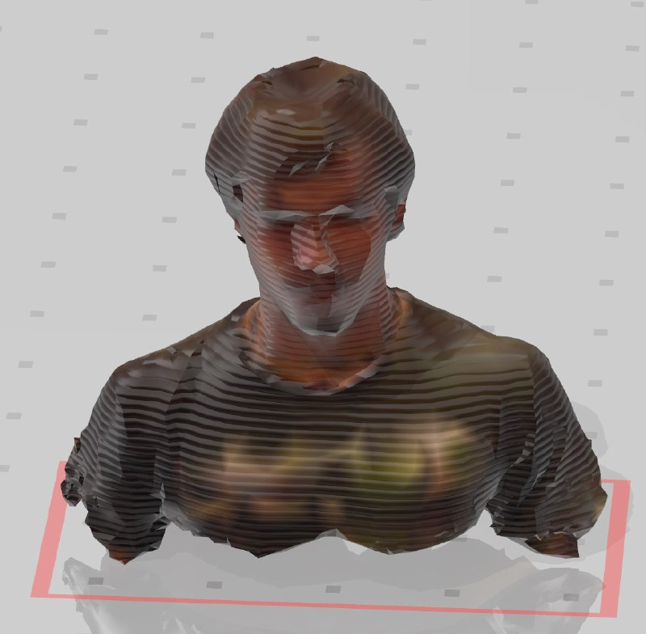
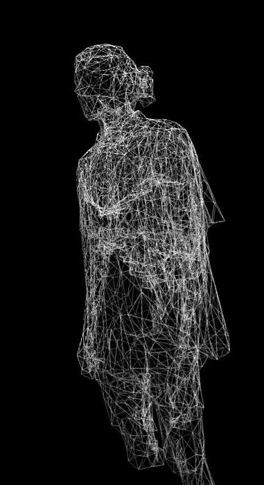

So today I am doing something completely different to all the things I upload to this website. I found my old Kinect for the Xbox 360, and wondered whether I could connect it to a PC to do some *crazy stuff*. After searching some information in Google, I found what I just needed: it was possible to use it as a 3D scanner, so I decided to try it myself.

## Hardware

For this project, you only need:

 - A Kinect (I am using the one for the Xbox 360).
 - A wall plug/USB adapter for the Kinect.
 - A PC/Laptop
 
You can find the necessary adapter pretty cheap on the internet. Note that if you are using a Windows-version Kinect you may not need it.

## Software

Since the Kinect version I am using is the older, I had trouble with some of the scanning programs I tried due to compatibility issues. For these testing purposes, I ended up using the free version of [Skanect](https://skanect.occipital.com/). However, I plan trying different software in a near future.

In order to scan an object or person, simple choose its measures in the setup screen of the program and start rotating the Kinect around it slowly. Once you think you may have finished scanning, simply stop the recording. You will be asket to move th scanned object into a "box" so that any recorded background gets deleted. Finally, you may modify some options such as model coloring or number of polygons in order to improve the final result. Once you have finished tweeking these sttings, just export the model as a .stl or .obj object.

## Results

Since I was using the free version of this software, I was not able to get any high-quality object from it. Nonetheless, the scanning capabilities of this kinect are simply amazing, and I plan improving the software side of this project for achieving much better results, and even attempting some 3D animations. Stay tuned for a second part of this project.
 

