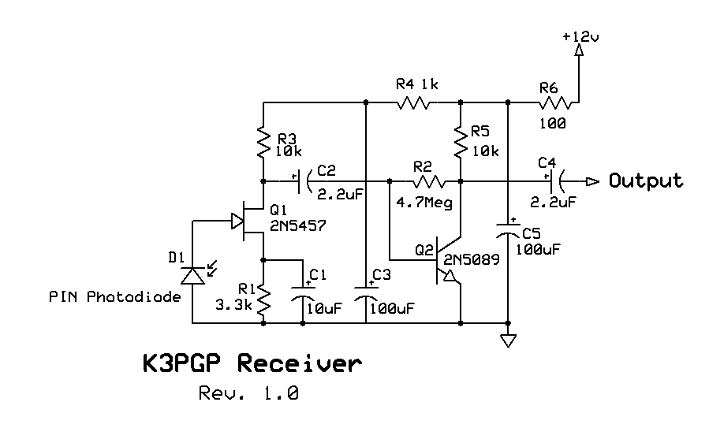
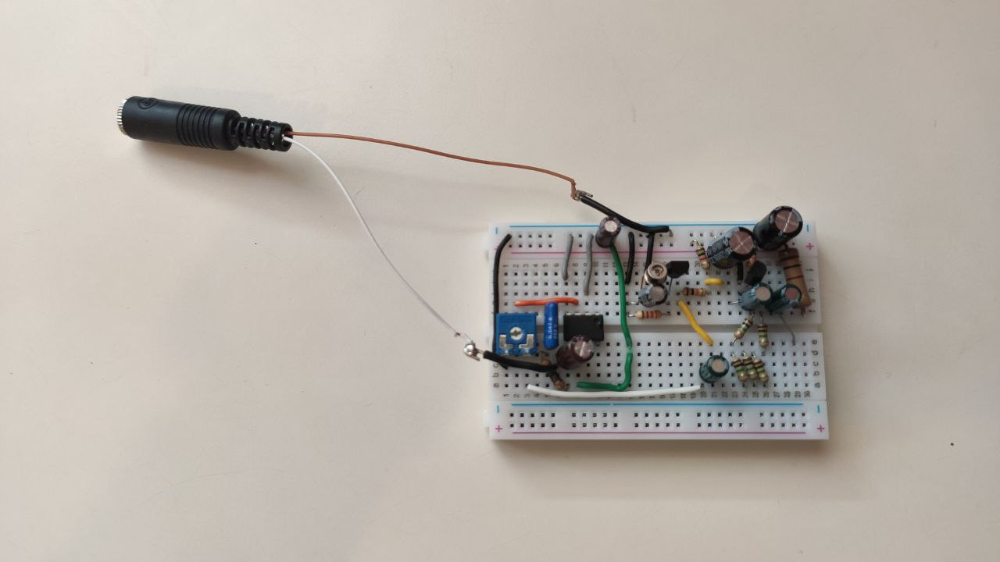
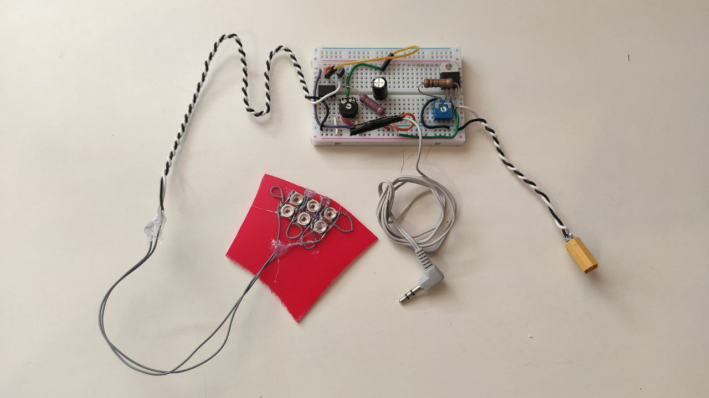
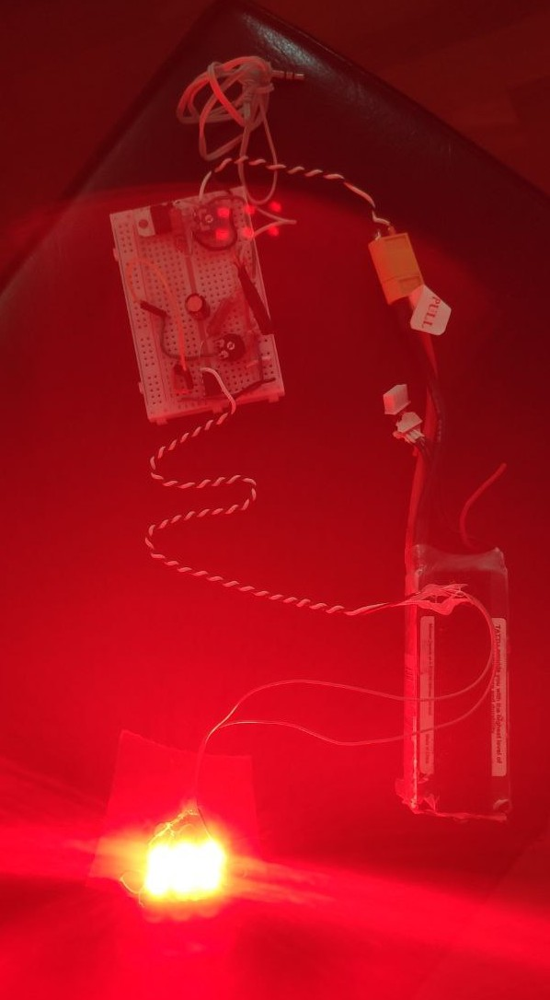

After the success of the first part of this project, where I achieved analog audio communication by applying amplitude modulation to a laser beam. On the last part of the post, I analised some of the improvements I could apply to the original design in order to improve its performance (better SNR with clearer audio and more range). In this second post, I will cover some of my progress on these improvements.

## The receiver

One of the main improvements was completely reworking the receiver circuit. I needed to replace that photoresistor with a photoidode. At first, I wanted to try an APD photodiode, but due to the unavailability of them at my local stores, I ended up going for a PIN photodiode. 

Because of the change between the resistor (it outputs a voltage signal) and the diode (it has a fixed voltage between its terminals and its current varies with the signal), we need a complete new circuit design. It must be made out of two main stages: the current to voltage converter and a voltage amplifier (the input signal at the diode will be incredibly low power).

After looking for some basic circuits around the internet for trying to modifytem according to my needs, I found a pretty interesting website: [modulatedlight](https://www.modulatedlight.org/optical_comms/optical_rx1.html). On that website, there is a simple schematic of a PIN-Diode-based receiver. Since it had few components, I decided to try it.

Instead of using the BJT amplifyer, I decided to modify the original circuit for using a LM386 (it is easier to regulate its gain and has a lower noise level). 

I achieved pretty good results with this receiver. The audio at the receiver was less filtered (better basses and high pitches) and, without futher precise testing or measurements, it seemed to
be more sensitive.

## The transmitter

As I commented on my last post, using a LASER for transitting an audio signal has a disadvantage: since it is coherent light, scintillation and scattering can cause loss of signals at medium to high ranges.

I decided then to replace the LASER with some LEDs. Since scattering is more present at higher frequencies (it is proportional to $$\frac{1}{\lambda^2}$$), I chose red LEDs. I bought six 3000mW LEDs, and connected them in two parallel rows of 3 LEDs in series.

Due to this LED configuration, the voltage drop accros the LEDS will be around 7,2V (2,4V each of the diodes). This value is greater than the one used for the LASER, and, having into account that LEDs have a slightly different P-I curve, we need to adjust both the DC offset and the amplitude of the audio signal in order to achieve a modulation without any distorsion.

I also added a LM317 in order to make the transmitter portable (I power it with a Li-Po battery).

## Results

After these changes, I realised that the audio at the receiver was pretty much a copy of the original one - there was no apparent distorsion nor filtring. Moreover, due to the incredibly large optical power of the LEDs and low sensitivity of the photodiode, I should be able to get a much higher range than with the previous setup. 

I plan on adding a Fresnel lens I bought for collimating the beam (350mm diameter and 355mm focal distance). If I get this done correctly, I will start testing the whole system outside measure its range.
