During my pursuit of the best antenna for receiving NOAA/Meteor images (I already built a Double-Cross antenna and a Turnstile, check my older posts), I decided to try a QFH antenna. I have always been a bit scared by QFHs because of their difficult construction: if you want a good symmetrical and rsistant antenna, you ought to use sopper tubing, which is difficult to bend and solder. However, some days ago I saw a [tweet](https://twitter.com/EA3AGBJavier/status/1282431932937248769) which gave me a pretty good idea: using some metal strip for the body of the helix.

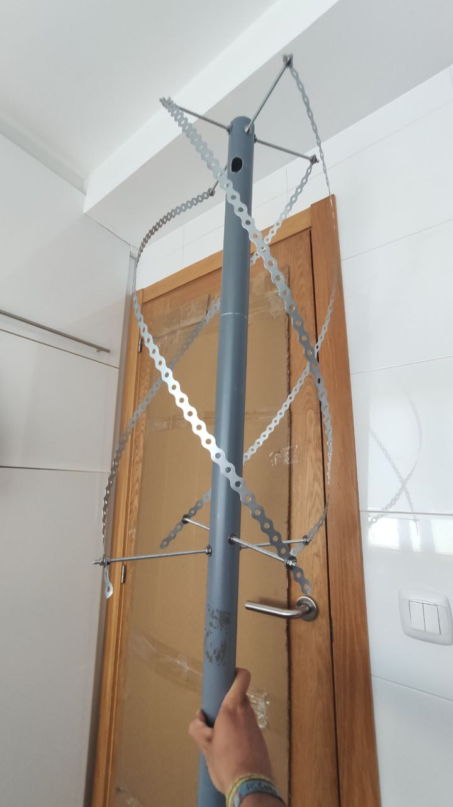

## Bill of materials

The parts needed for building this awesome antenna are:

  - **Perforated metal strip**. Any should get the job done, choose the one that fits better your needs. 5m will be enought.
  - **Threaded rod**. You will need around 2m. See the plans below for the exact measures. Diameter is not very important (theoretically, the thicker, the more broadband the antenna will be). I chose 6mm rods (pretty standard and easy to find).
  - **PVC (or any other non conductive material) pipe**. At least 70cm of pipe. However, this will be the mast of our antenna, so the taller, the better.
  - **Washers**. For the diameter of the threaded rod. I bought a pack of 30.
  - **Nuts**. The same sa the wathers.
  - **Coax cable**. I used RG-58, since it was the cheapest. Make sure it is 50Ohm coax. Choose its length according to the length of the mast.
  - **SMA male connector**. For the RG-58 cable.
  
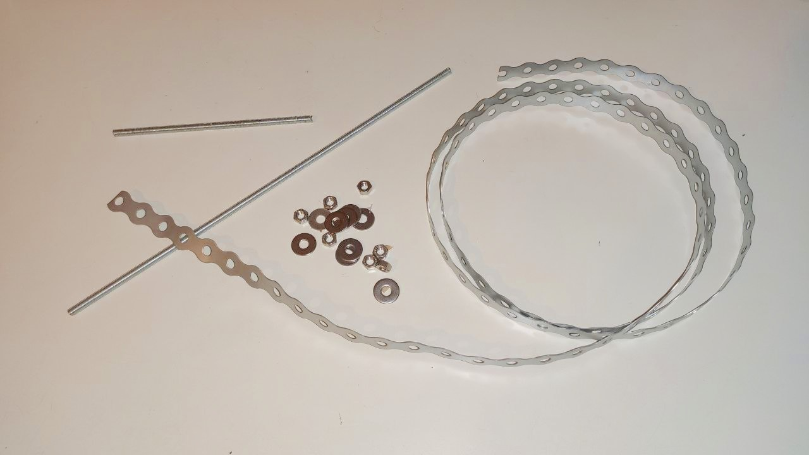
  
## Building

When I was building this antenna, I had no clue about what the correct measures of each element would be. I took [this website's](http://jcoppens.com/ant/qfh/calc.en.php) calculations as a reference, but I knew that, since the materials I was using were much different from the ones indicated there, that I would need to tune my antenna in order to achive an optimal performance. For this reason, I did not cut any of the elements the exact same length that website indicated, but a bit longer (around 1cm the rods and 2cm the metal strips), so that, after finishing the build, I would end up with an antenna tuned to a lower frequency and, with the help of a NanoVNA, I would be able to tune it to 137,5MHz by screwing the nuts and cutting the excess of metal. The, before giving the exact measures of my antenna, you must be aware that these lengths may not be the same for you, depending on the metal parts you buy (separation between holes or width of the metal strip, diameter of the rods...). 

Recall that I used 6mm rods/nuts/washers and around 15mm wide (not uniform) metal strip with a hole each 20mm.

The antena is divided into two loops: one of them is tuned above the center frquency (2-3MHz above) and, the other one, under the center frequency (also around 2-3MHz).

|                         | Large loop | Small loop |
|:-----------------------:|:--------:|:----------:|
|        Heigh (mm)       |    765   |     730    |
|        Width (mm)       |   27,8   |    24,4    |
| Length of strip (holes) |    46    |     43     |
|   Length of strip (mm)  |    920   |     860    |

Once you have cuted all the metal pieces accordingly, the assembly is pretty straightforward: simply drill the PCV pipe and introduce the rods with some nuts and washers to fix them. Recall that, at the bottom part of the helix, there are only 2 rods, while, at the top part, there should be 4 differents rods (the loops must be open, not a short circuit). After the assembly of the bars, insert the metal strip for the helix between two washers.

Finally, it is important to connect correctly the coax to the antenna. For this purpose, I just cuted four 3cm long pieces of metal strip, made a small fissure on their center and introduced and soldered a cable thought it. Solder the coax to the corresponding cables and screw these parts to the antenna inside the PVC pipe.

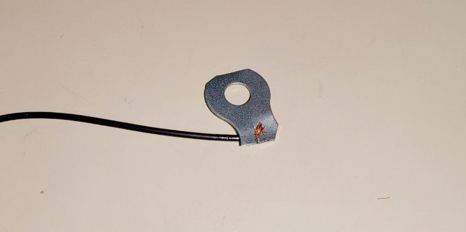

## Measuring and tuning the antenna

After finishing the build (not with the measures from the table above, they are the definitive ones), I was time to measure the antenna (checking its SWR) and tuning it to the desired frequency (137,5MHz). This was the result of the very first test:

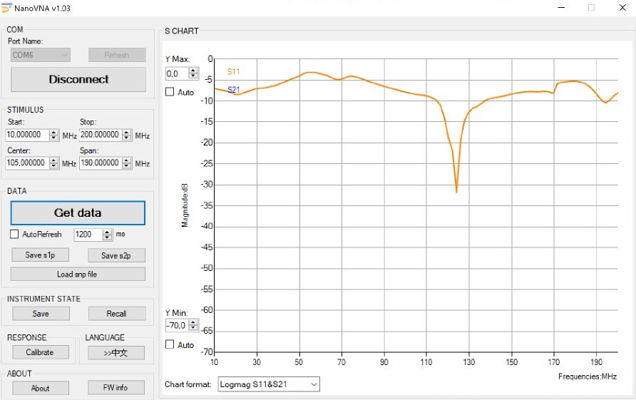

Since the antenna was tuned to a much lower frequency, I screwed a bit each nut of each loop and studied the changes that this was producing on the antenna performance. After tweeking a lot all the nuts, I ended up with the following results:

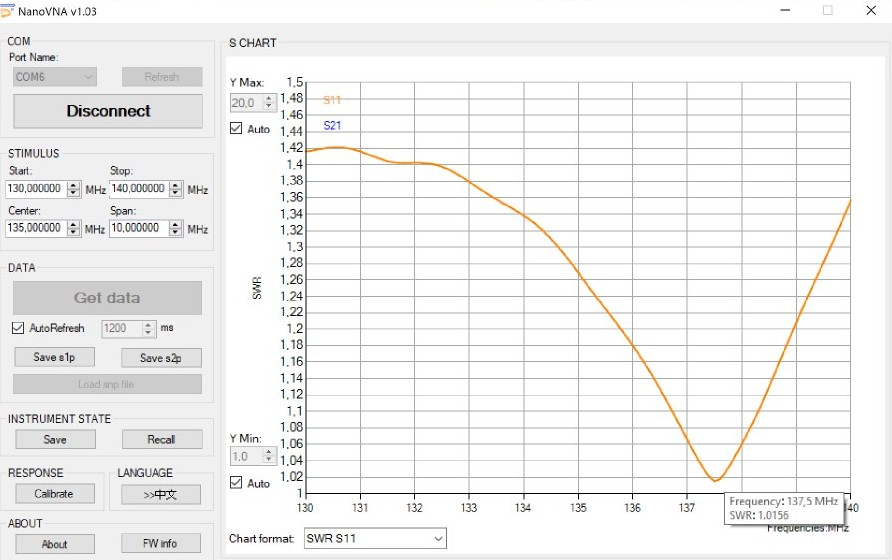

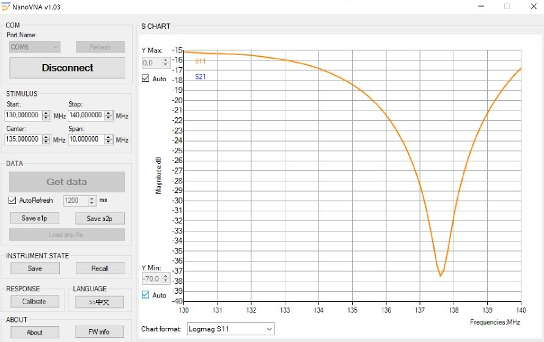

A SWR of only 1,016! That is crazy, so I could not wait for trying to receive some images from NOAA and Meteor satellites with my new setup.

## Very first images

The performance of this antenna is just great: in spite of my bad location, it managed to achieve a lock and a clear constellation on a LRPT transmission at only 6º of elevation!

### NOAA satellites

#### Signal at low elevation (10.5º)

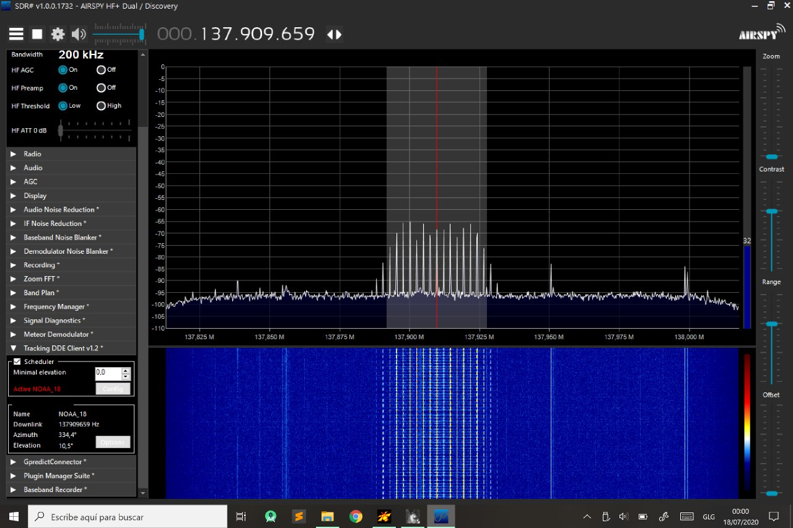

#### Signal at high elevation (54.1º)

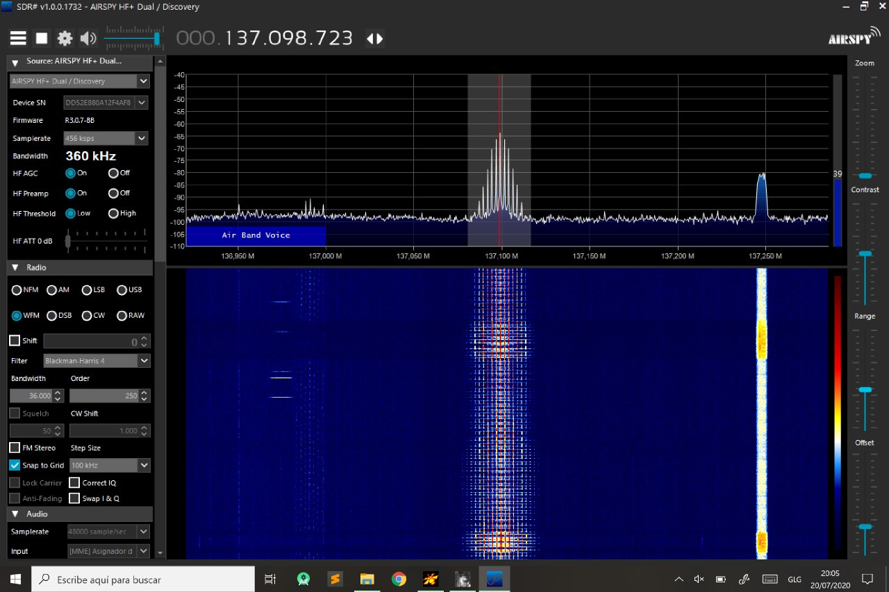

#### Images

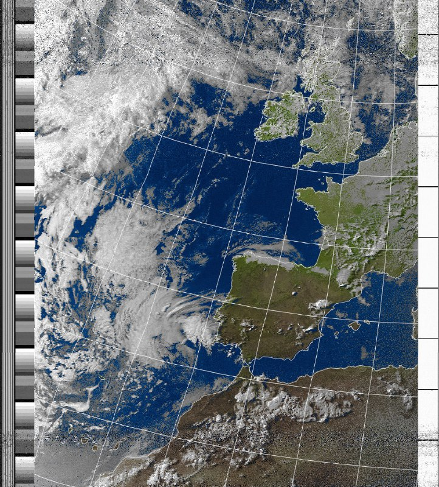

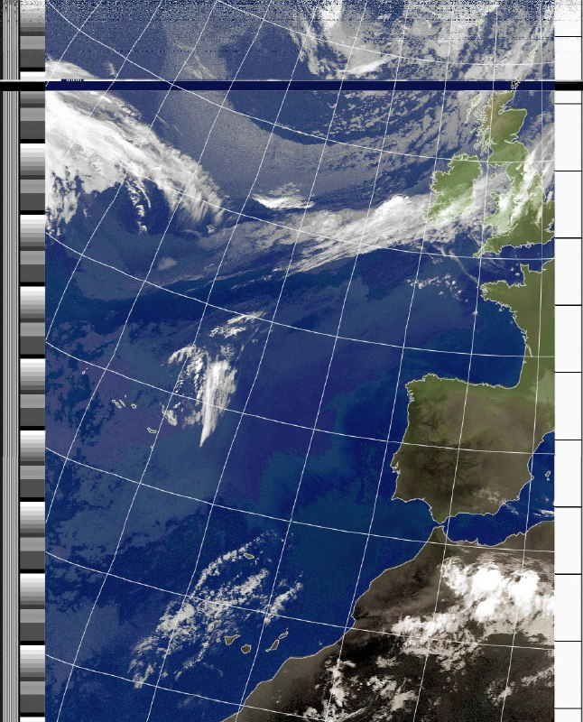

### Meteor M2

#### Signal at low elevation (3.3º, bad propagation)

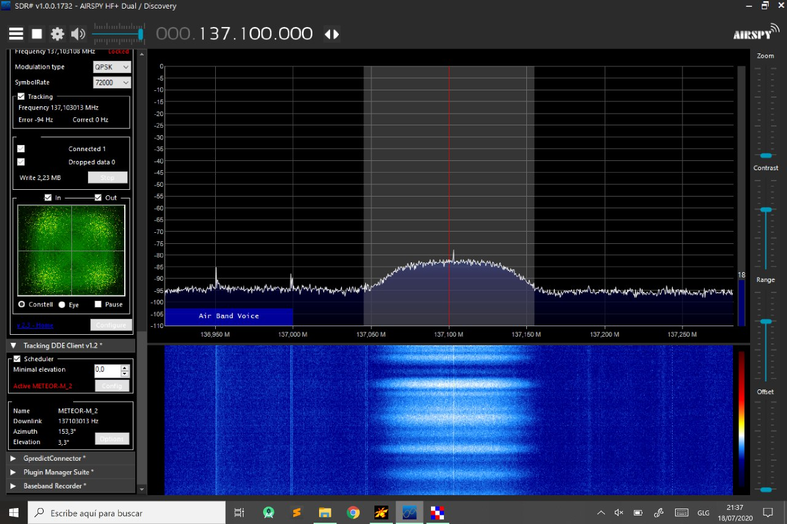

#### Signal at high elevation (58.5º)

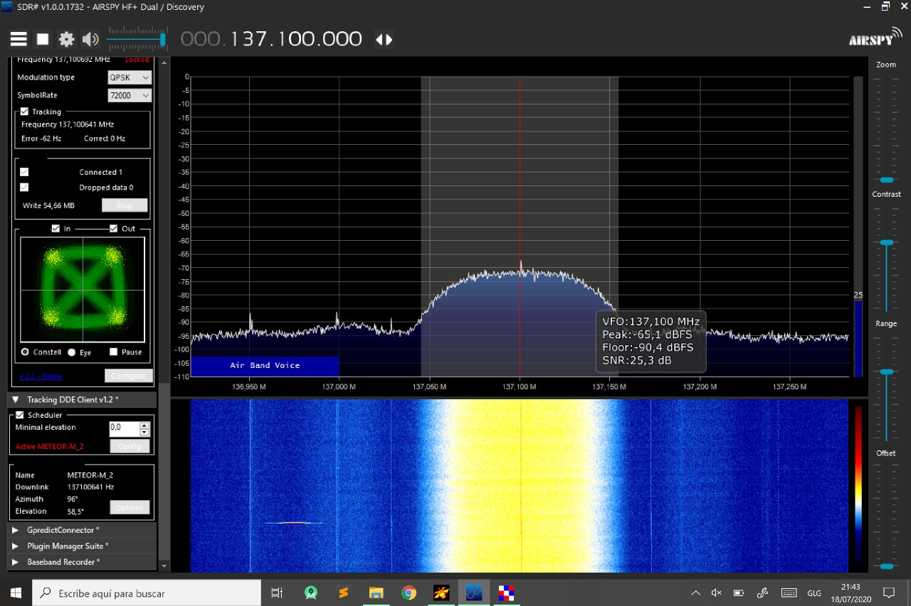

#### Images

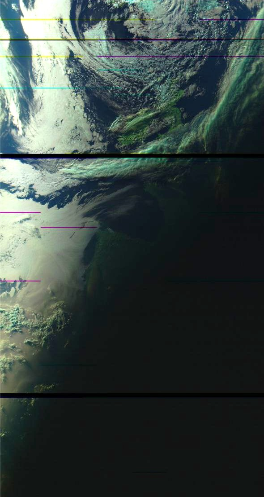

## Conclusion

Definitely, this antenna offers a better performance than the Turnstile I made a while ago, and maybe even better thatn the double cross antenna too.

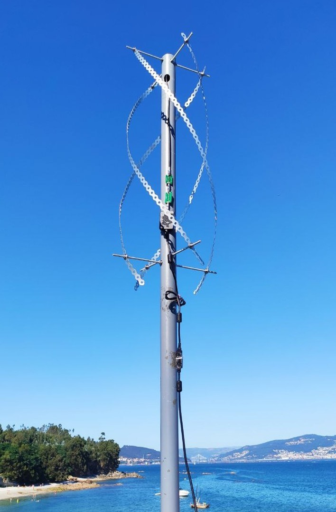

Now, in order to further improve my results and being able to receive even lower satellite passes, I will need to continue optimising the rest of my setup. Maybe building a good bandpass filter for these frequencies could be the way to go!
